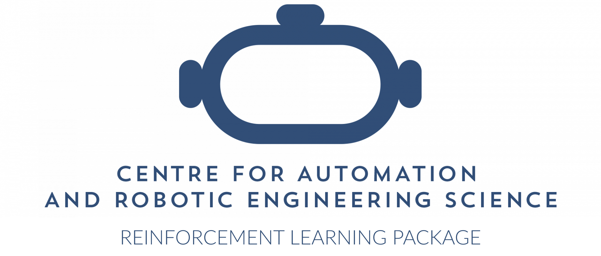
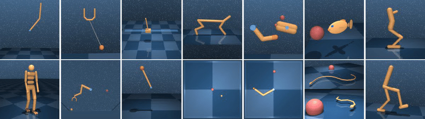
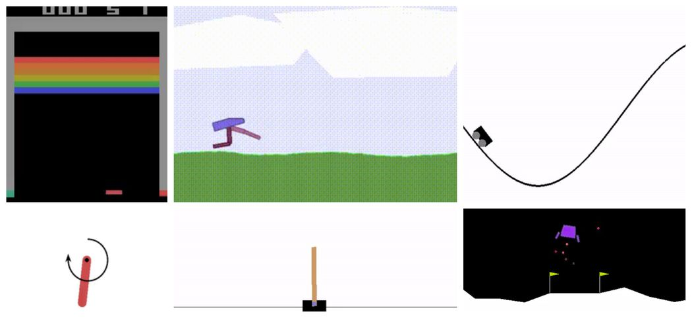
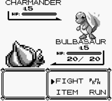
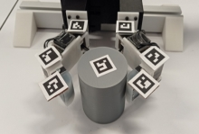
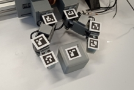
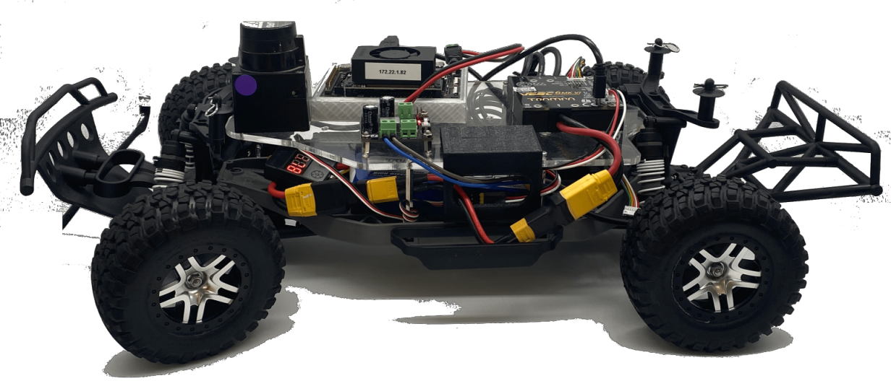

<p align="center">

</p>

The CARES reinforcement learning bed used as the foundation for RL related projects.

# Motivation

**Reinforcement Learning Algorithms** (that is to say, *how* the Neural Networks are updated) stay the same no matter the application. This package is designed so that these algorithms are only programmed **once** and can be *"plugged & played"* into different environments.

# Usage
Consult the repository [wiki](https://github.com/UoA-CARES/cares_reinforcement_learning/wiki) for a guide on how to use the package

# Installation Instructions


`git clone` the repository into your desired directory on your local machine

Run `pip3 install -r requirements.txt` in the **root directory** of the package

To make the module **globally accessible** in your working environment run `pip3 install --editable .` in the **project root**

# Running an Example

This package serves as a library of specific RL algorithms and utility functions being used by the CARES RL team. For an example of how to use this package in your own environments see the example gym packages below that use these algorithms for training agents on a variety of simulated and real-world tasks.

## Gym Environments

We have created a standardised general purpose gym that wraps the most common simulated environments used in reinforcement learning into a single easy to use place:  https://github.com/UoA-CARES/gymnasium_envrionments

This package contains wrappers for the following gym environments:

### Deep Mind Control Suite

The standard Deep Mind Control suite: https://github.com/google-deepmind/dm_control

<p align="center">
    
</p>

### OpenAI Gymnasium

The standard OpenAI Gymnasium: https://github.com/Farama-Foundation/Gymnasium

<p align="center">
    
</p>

### Game Boy Emulator

Environment running Gameboy games utilising the pyboy wrapper: https://github.com/UoA-CARES/pyboy_environment

<p align="center">
    
    
</p>

## Gripper Gym

The gripper gym contains all the code for training our dexterous robotic manipulators: https://github.com/UoA-CARES/gripper_gym

<p align="center">
    
    
</p>

## F1Tenth Autonomous Racing

The Autonomous F1Tenth package contains all the code for training our F1Tenth platforms to autonomously race: https://github.com/UoA-CARES/autonomous_f1tenth

<p align="center">
    
</p>

# Package Structure

```text
cares_reinforcement_learning/
├─ algorithm/
├─ encoders/
│  ├─ autoencoder.py
│  ├─ ...
├─ policy/
│  │  ├─ TD3.py
│  │  ├─ ...
│  ├─ value/
│  │  ├─ DQN.py
│  │  ├─ ...
├─ memory/
│  ├─ prioritised_replay_buffer.py
├─ networks/
│  ├─ DQN/
│  │  ├─ network.py
│  ├─ TD3.py/
│  │  ├─ actor.py
│  │  ├─ critic.py
│  ├─ ...
├─ util/
│  ├─ network_factory.py
│  ├─ ...
```

`algorithm`: contains update mechanisms for neural networks as defined by the algorithm.

`encoders`: contains the implementations for various autoencoders and variational autoencoders

`memory`: contains the implementation of various memory buffers - e.g. Prioritised Experience Replay

`networks`: contains standard neural networks that can be used with each algorithm

`util`: contains common utility classes

# Encoders
An autoencoder consists of an encoder that compresses input data into a latent representation and a decoder that reconstructs the original data from this compressed form. Variants of autoencoders, such as Variational Autoencoders (VAEs) and Beta-VAEs, introduce probabilistic elements and regularization techniques to enhance the quality and interpretability of the latent space. While standard autoencoders focus on reconstruction accuracy, advanced variants like Beta-VAE and Squared VAE (SqVAE) aim to improve latent space disentanglement and sparsity, making them valuable for generating more meaningful and structured representations.

We have re-implemented a range of autoencoder/variational-autoencoder methodologies for use with the RL algorithms implemented within this library.
For more information on the encoders available in this package, please refer to the [README](./cares_reinforcement_learning/encoders/README.md) in the encoders folder.
These algorithms can be used stand-alone beyond their use here for RL. 

# Utilities

CARES RL provides a number of useful utility functions and classes for generating consistent results across the team. These utilities should be utilised in the new environments we build to test our approaches.

## Record.py

The Record class allows data to be saved into a consistent format during training. This allows all data to be consistently formatted for plotting against each other for fair and consistent evaluation.

All data from a training run is saved into the directory specified in the `CARES_LOG_BASE_DIR` environment variable. If not specified, this will default to `'~/cares_rl_logs'`.

You may specify a custom log directory format using the `CARES_LOG_PATH_TEMPLATE` environment variable. This path supports variable interpolation such as the algorithm used, seed, date etc. This defaults to `"{algorithm}/{algorithm}-{domain_task}-{date}"`.

This folder will contain the following directories and information saved during the training session:

```text
├─ <log_path>
|  ├─ env_config.json
|  ├─ alg_config.json
|  ├─ train_config.json
|  ├─ *_config.json
|  ├─ ...
|  ├─ SEED_N
|  |  ├─ data
|  |  |  ├─ train.csv
|  |  |  ├─ eval.csv
|  |  ├─ figures
|  |  |  ├─ eval.png
|  |  |  ├─ train.png
|  |  ├─ models
|  |  |  ├─ model.pht
|  |  |  ├─ CHECKPOINT_N.pht
|  |  |  ├─ ...
|  |  ├─ videos
|  |  |  ├─ STEP.mp4
|  |  |  ├─ ...
|  ├─ SEED_N
|  |  ├─ ...
|  ├─ ...
```

## plotting.py

The plotting utility will plot the data contained in the training data based on the format created by the Record class. An example of how to plot the data from one or multiple training sessions together is shown below.

Running 'python3 plotter.py -h' will provide details on the plotting parameters and control arguments. You can custom set the font size and text for the title, and axis labels - defaults will be taken from the data labels in the csv files.

```sh
python3 plotter.py -h
```

Plot the results of a single training instance

```sh
python3 plotter.py -s ~/cares_rl_logs -d ~/cares_rl_logs/ALGORITHM/ALGORITHM-TASK-YY_MM_DD:HH:MM:SS
```

Plot and compare the results of two or more training instances

```sh
python3 plotter.py -s ~/cares_rl_logs -d ~/cares_rl_logs/ALGORITHM_A/ALGORITHM_A-TASK-YY_MM_DD:HH:MM:SS ~/cares_rl_logs/ALGORITHM_B/ALGORITHM_B-TASK-YY_MM_DD:HH:MM:SS
```

## configurations.py

Provides baseline data classes for environment, training, and algorithm configurations to allow for consistent recording of training parameters.

## NetworkFactory.py

A factory class for creating a baseline RL algorithm that has been implemented into the CARES RL package.

## MemoryFactory.py

A factory class for creating a memory buffer that has been implemented into the CARES RL package.

# Supported Algorithms 

We support a wide range of algorithms in the Reinforcement Learning space all under the same abstraction. 

## Q-Learning
Implementations of Q-Learning based methods

| Algorithm   | Observation Space          | Action Space | Paper Reference                                             |
| ----------- | -------------------------- | ------------ | ----------------------------------------------------------- |
| DQN         | Vector                     | Discrete     | [DQN Paper](https://arxiv.org/abs/1312.5602)                |
| PERDQN      | Vector                     | Discrete     | [PERDQN Paper](https://arxiv.org/abs/1511.05952)            |
| DoubleDQN   | Vector                     | Discrete     | [DoubleDQN Paper](https://arxiv.org/abs/1509.06461)         |
| DuelingDQN  | Vector                     | Discrete     | [DuelingDQN Paper](https://arxiv.org/abs/1511.06581)        |
| NoisyNet    | Vector                     | Discrete     | [NoisyNet Paper](https://arxiv.org/abs/1706.10295)          |
| C51         | Vector                     | Discrete     | [C51 Paper](https://arxiv.org/pdf/1707.06887)               |
| QRDQN       | Vector                     | Discrete     | [QR-DQN Paper](https://arxiv.org/pdf/1710.10044)            |
| Rainbow     | Vector                     | Discrete     | [Rainbow](https://arxiv.org/pdf/1710.02298)                 |

## Actor Critic
Implementation of various Actor Critic methods.

| Algorithm   | Observation Space          | Action Space | Paper Reference                                             |
| ----------- | -------------------------- | ------------ | ---------------                                             |
| PPO         | Vector                     | Continuous   | [PPO Paper](https://arxiv.org/abs/1707.06347)               |
| DDPG        | Vector                     | Continuous   | [DDPG Paper](https://arxiv.org/pdf/1509.02971v5.pdf)        |
| TD3         | Vector                     | Continuous   | [TD3 Paper](https://arxiv.org/abs/1802.09477v3)             |
| SAC         | Vector                     | Continuous   | [SAC Paper](https://arxiv.org/abs/1812.05905)               |
| PERTD3      | Vector                     | Continuous   | [PERTD3 Paper](https://arxiv.org/abs/1511.05952)            |
| PERSAC      | Vector                     | Continuous   | [PERSAC Paper](https://arxiv.org/abs/1511.05952)            |
| PALTD3      | Vector                     | Continuous   | [PALTD3 Paper](https://arxiv.org/abs/2007.06049)            |
| LAPTD3      | Vector                     | Continuous   | [LAPTD3 Paper](https://arxiv.org/abs/2007.06049)            |
| LAPSAC      | Vector                     | Continuous   | [LAPSAC Paper](https://arxiv.org/abs/2007.06049)            |
| LA3PTD3     | Vector                     | Continuous   | [LA3PTD3 Paper](https://arxiv.org/abs/2209.00532)           |
| LA3PSAC     | Vector                     | Continuous   | [LA3PSAC Paper](https://arxiv.org/abs/2209.00532)           |
| MAPERTD3    | Vector                     | Continuous   | [MAPERTD3 Paper](https://openreview.net/pdf?id=WuEiafqdy9H) |
| MAPERSAC    | Vector                     | Continuous   | [MAPERSAC Paper](https://openreview.net/pdf?id=WuEiafqdy9H) |
| RDTD3       | Vector                     | Continuous   | [RDTD3 Paper](https://arxiv.org/abs/2501.18093)             |
| RDSAC       | Vector                     | Continuous   | [RDSAC Paper](https://arxiv.org/abs/2501.18093)             |
| REDQ        | Vector                     | Continuous   | [REDQ Paper](https://arxiv.org/pdf/2101.05982.pdf)          |
| TQC         | Vector                     | Continuous   | [TQC Paper](https://arxiv.org/pdf/2005.04269)               |
| CTD4        | Vector                     | Continuous   | [CTD4 Paper](https://arxiv.org/abs/2405.02576)              |
| CrossQ      | Vector                     | Continuous   | [CrossQ Paper](https://arxiv.org/pdf/1902.05605)            |
| Droq        | Vector                     | Continuous   | [DroQ Paper](https://arxiv.org/abs/2110.02034)              |
| SDAR        | Vector                     | Continuous   | [SDAR Paper](https://openreview.net/pdf?id=PDgZ3rvqHn)      |
| TD7         | Vector                     | Continuous   | [TD7 Paper](https://arxiv.org/pdf/2306.02451)               |
| SACD        | Vector                     | Discrete     | [SAC-Discrete Paper](https://arxiv.org/pdf/1910.07207)      |
| ----------- | -------------------------- | ------------ | ---------------                                             |
| NaSATD3     | Image                      | Continuous   | [NaSATD3 Paper](https://ieeexplore.ieee.org/abstract/document/10801857) |
| TD3AE       | Image                      | Continuous   | [TD3AE Paper](https://arxiv.org/abs/1910.01741)             |
| SACAE       | Image                      | Continuous   | [SACAE Paper](https://arxiv.org/abs/1910.01741)             |

## Unsupervised Skill Discovery
Implementation of Unsupervised Skill discovery methods

| Algorithm                                | Observation Space          | Action Space | Paper Reference                                 |
| ---------------------------------------- | -------------------------- | ------------ | ---------------                                 |
| DIAYN (Diversity Is All You Need)        | Vector                     | Continuous   | [DIYAN Paper](https://arxiv.org/pdf/1802.06070) |
| DADS Dynamics-Aware Discovery OF Skills  | Vector                     | Continuous   | [DADS Paper](https://arxiv.org/pdf/1907.01657)  |

# Citation
```
@misc{cares_reinforcement_learning,
  title = {CARES Reinforcement Learning},
  author = {CARES},
  year = {2025},
  publisher = {GitHub},
  url = {https://https://github.com/UoA-CARES/cares_reinforcement_learning.}
}
```