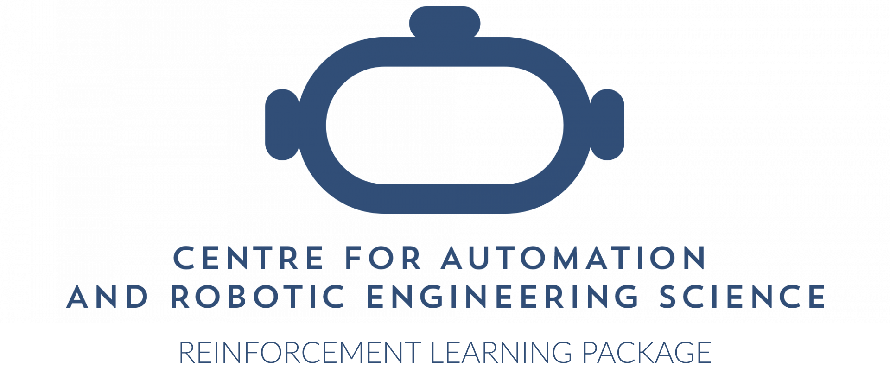
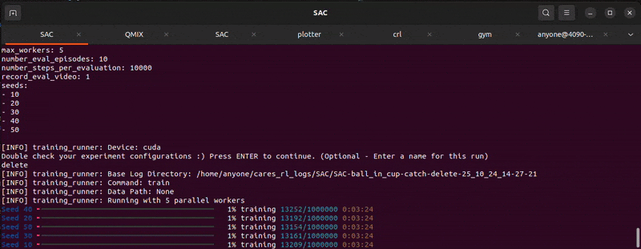
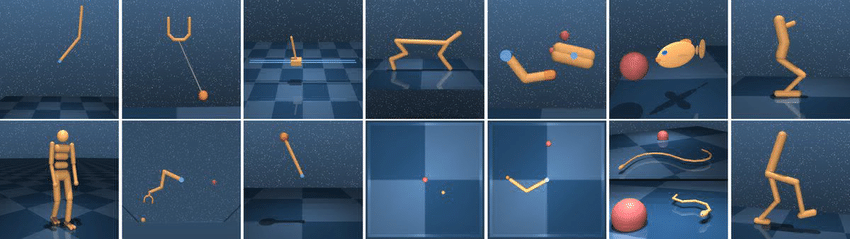
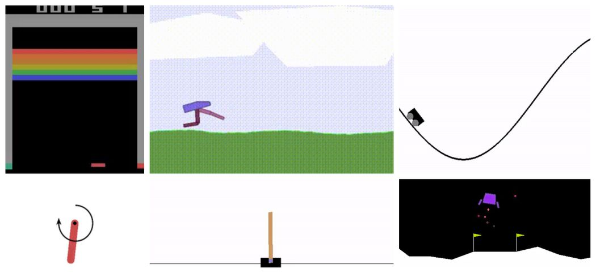
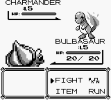
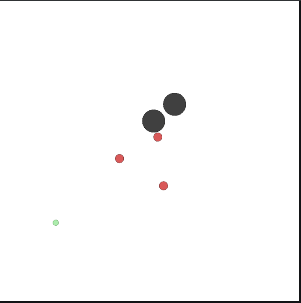

<p align="center">

</p>

The CARES reinforcement learning bed used as the foundation for RL related projects.

# Motivation

**Reinforcement Learning Algorithms** (that is to say, *how* the Neural Networks are updated) stay the same no matter the application. This package is designed so that these algorithms are only programmed **once** and can be *"plugged & played"* into different environments.

# Installation Instructions


`git clone` the repository into your desired directory on your local machine

To make the module **globally accessible** in your working environment run `pip install --editable .[gym]` in the **project root**

# Usage
We have created a standardised general purpose gym that wraps the most common simulated environments used in reinforcement learning into a single easy to use place. 

## Running Training and Evaluation
The packagage is called using the cli command `cares-rl`. This takes in specific commands list below for training and evaluation purposes. The installed command runs the `run.py` in the main directoy.

Use `cares-rl -h` for help on what parameters are available for customisation.

### Train
The train command in the run.py script is used to initiate the training process for reinforcement learning models within specified gym environments. This command can be customized using various hyperparameters to tailor the training environment and the RL algorithm. You can use python `run.py train cli -h` to view all available options for customization and start a run directly through the terminal. This flexibility enables users to experiment with different settings and optimize their models effectively.

Specific and larger configuration changes can be loaded using python `run.py train config --data_path <PATH_TO_TRAINING_CONFIGS>`, allowing for a more structured and repeatable training setup through configuration files including modification of network structures for given algorithms.

```
cares-rl train cli -h
cares-rl train config --data_path <PATH_TO_TRAINING_CONFIGS>
```

Training can run training across seeds in parrellel using the `--max_workers` parameter which will run each training seed in its own process. 

```
cares-rl train cli --gym openai --task HalfCheetah-v4 TD3 --seeds 10 20 30 40 50 --max_workers 5
```

<p align="center">
    
</p>


### Resume (Experimental)
The resume command allows you to continue training from a previously saved checkpoint. This is useful if training was interrupted or if you want to further improve a model. You can specify the path to the checkpoint and resume training with your desired settings.

Note: to enable a training to be resumable you need to enable the `--save_train_checkpoints 1` when using the train command. Checkpoint saving does not default to true, this is because saving a checkpoint of the memory, and training parameters increases data storage on the HD - especially for image based learning. This is also an experimental feature and the `resume` does not set all parameters/evnrioments to the same state as before - this will change the training outcomes, it is not a true resume command but it is useful for restarting training.

```
cares-rl resume --data_path <PATH_TO_TRAINING_DATA>
```

### Evaluate
The evaluate command is used to re-run the evaluation loops from a prior training run - this will reproduce the evaluation graphs and data from a given training experiment. Useful if you have updated metrics you want to capture without having to re-run the entire training process.

```
cares-rl evaluate --data_path <PATH_TO_TRAINING_DATA>
```

### Test
The test command is used to run evaluation loops on a trained reinforcement learning model on the envrionment, users can load the trained model to evaluate how well the model performs on the given task with different evaluation seeds and over any number of episodes. 

```
cares-rl test --data_path <PATH_TO_TRAINING_DATA> --eval_seed <EVAL_SEED> --episodes <NUM_EPISODES>
```

## Gym Environments
This package contains wrappers for the following gym environments - these wrapper standardise the different interfaces various tasks/environments use so we can use the same algorithm interface. 

#### Deep Mind Control Suite
The standard Deep Mind Control suite: https://github.com/google-deepmind/dm_control

```
cares-rl train cli --gym dmcs --domain ball_in_cup --task catch TD3
```

<p align="center">
    
</p>

#### OpenAI Gymnasium
The standard OpenAI Gymnasium: https://github.com/Farama-Foundation/Gymnasium 

```
cares-rl train cli --gym openai --task CartPole-v1 DQN

cares-rl train cli --gym openai --task HalfCheetah-v4 TD3
```

<p align="center">
    
</p>

#### Game Boy Emulator
Environment running Gameboy games utilising the pyboy wrapper: https://github.com/UoA-CARES/pyboy_environment 

```
cares-rl train cli --gym pyboy --task mario SACAE
```

<p align="center">
    
    
</p>

### Drone Gym

The Drone gym contains all the code for training the CrazyFly drone on navigation tasks: https://github.com/UoA-CARES/drone_gym

<p align="center">
    
</p>

### SMAC/SMACv2

### Gripper Gym

### MPE2

The standard MPE2 environment: https://mpe2.farama.org/

<p align="center">
    
</p>

## Training Data Logs
All data from a training run is saved into the directory specified in the `CARES_LOG_BASE_DIR` environment variable. If not specified, this will default to `'~/cares_rl_logs'`.

You may specify a custom log directory format using the `CARES_LOG_PATH_TEMPLATE` environment variable. This path supports variable interpolation such as the algorithm used, seed, date etc. This defaults to `"{algorithm}/{algorithm}-{domain_task}-{date}"`.

This folder will contain the following directories and information saved during the training session:

```text
├─ <log_path>
|  ├─ env_config.json
|  ├─ alg_config.json
|  ├─ train_config.json
|  ├─ *_config.json
|  ├─ ...
|  ├─ SEED_N
|  |  ├─ data
|  |  |  ├─ train.csv
|  |  |  ├─ eval.csv
|  |  ├─ figures
|  |  |  ├─ eval.png
|  |  |  ├─ train.png
|  |  ├─ models
|  |  |  ├─ model.pht
|  |  |  ├─ CHECKPOINT_N.pht
|  |  |  ├─ ...
|  |  ├─ videos
|  |  |  ├─ STEP.mp4
|  |  |  ├─ ...
|  ├─ SEED_N
|  |  ├─ ...
|  ├─ ...
```

## Plotting
The plotting utility in will plot the data contained in the training data based on the format created by the Record class. An example of how to plot the data from one or multiple training sessions together is shown below.

Running 'cares-rl-plot -h' will provide details on the plotting parameters and control arguments. You can custom set the font size and text for the title, and axis labels - defaults will be taken from the data labels in the csv files.

```sh
cares-rl-plot -h
```

Plot the results of a single training instance

```sh
cares-rl-plot -s ~/cares_rl_logs -d ~/cares_rl_logs/ALGORITHM/ALGORITHM-TASK-YY_MM_DD:HH:MM:SS
```

Plot and compare the results of two or more training instances

```sh
cares-rl-plot -s ~/cares_rl_logs -d ~/cares_rl_logs/ALGORITHM_A/ALGORITHM_A-TASK-YY_MM_DD:HH:MM:SS ~/cares_rl_logs/ALGORITHM_B/ALGORITHM_B-TASK-YY_MM_DD:HH:MM:SS
```

# Supported Algorithms 

We support a wide range of algorithms in the Reinforcement Learning space all under the same abstraction. 

## Q-Learning
Implementations of Q-Learning based methods

| Algorithm   | Observation Space          | Action Space | Paper Reference                                             |
| ----------- | -------------------------- | ------------ | ----------------------------------------------------------- |
| DQN         | Vector                     | Discrete     | [DQN Paper](https://arxiv.org/abs/1312.5602)                |
| PERDQN      | Vector                     | Discrete     | [PERDQN Paper](https://arxiv.org/abs/1511.05952)            |
| DoubleDQN   | Vector                     | Discrete     | [DoubleDQN Paper](https://arxiv.org/abs/1509.06461)         |
| DuelingDQN  | Vector                     | Discrete     | [DuelingDQN Paper](https://arxiv.org/abs/1511.06581)        |
| NoisyNet    | Vector                     | Discrete     | [NoisyNet Paper](https://arxiv.org/abs/1706.10295)          |
| C51         | Vector                     | Discrete     | [C51 Paper](https://arxiv.org/pdf/1707.06887)               |
| QRDQN       | Vector                     | Discrete     | [QR-DQN Paper](https://arxiv.org/pdf/1710.10044)            |
| Rainbow     | Vector                     | Discrete     | [Rainbow](https://arxiv.org/pdf/1710.02298)                 |

## Actor Critic
Implementation of various Actor Critic methods.

| Algorithm   | Observation Space          | Action Space | Paper Reference                                             |
| ----------- | -------------------------- | ------------ | ---------------                                             |
| PPO         | Vector                     | Continuous   | [PPO Paper](https://arxiv.org/abs/1707.06347)               |
| DDPG        | Vector                     | Continuous   | [DDPG Paper](https://arxiv.org/pdf/1509.02971v5.pdf)        |
| TD3         | Vector                     | Continuous   | [TD3 Paper](https://arxiv.org/abs/1802.09477v3)             |
| SAC         | Vector                     | Continuous   | [SAC Paper](https://arxiv.org/abs/1812.05905)               |
| PERTD3      | Vector                     | Continuous   | [PERTD3 Paper](https://arxiv.org/abs/1511.05952)            |
| PERSAC      | Vector                     | Continuous   | [PERSAC Paper](https://arxiv.org/abs/1511.05952)            |
| PALTD3      | Vector                     | Continuous   | [PALTD3 Paper](https://arxiv.org/abs/2007.06049)            |
| LAPTD3      | Vector                     | Continuous   | [LAPTD3 Paper](https://arxiv.org/abs/2007.06049)            |
| LAPSAC      | Vector                     | Continuous   | [LAPSAC Paper](https://arxiv.org/abs/2007.06049)            |
| LA3PTD3     | Vector                     | Continuous   | [LA3PTD3 Paper](https://arxiv.org/abs/2209.00532)           |
| LA3PSAC     | Vector                     | Continuous   | [LA3PSAC Paper](https://arxiv.org/abs/2209.00532)           |
| MAPERTD3    | Vector                     | Continuous   | [MAPERTD3 Paper](https://openreview.net/pdf?id=WuEiafqdy9H) |
| MAPERSAC    | Vector                     | Continuous   | [MAPERSAC Paper](https://openreview.net/pdf?id=WuEiafqdy9H) |
| RDTD3       | Vector                     | Continuous   | [RDTD3 Paper](https://arxiv.org/abs/2501.18093)             |
| RDSAC       | Vector                     | Continuous   | [RDSAC Paper](https://arxiv.org/abs/2501.18093)             |
| REDQ        | Vector                     | Continuous   | [REDQ Paper](https://arxiv.org/pdf/2101.05982.pdf)          |
| TQC         | Vector                     | Continuous   | [TQC Paper](https://arxiv.org/pdf/2005.04269)               |
| CTD4        | Vector                     | Continuous   | [CTD4 Paper](https://arxiv.org/abs/2405.02576)              |
| CrossQ      | Vector                     | Continuous   | [CrossQ Paper](https://arxiv.org/pdf/1902.05605)            |
| Droq        | Vector                     | Continuous   | [DroQ Paper](https://arxiv.org/abs/2110.02034)              |
| SDAR        | Vector                     | Continuous   | [SDAR Paper](https://openreview.net/pdf?id=PDgZ3rvqHn)      |
| TD7         | Vector                     | Continuous   | [TD7 Paper](https://arxiv.org/pdf/2306.02451)               |
| SACD        | Vector                     | Discrete     | [SAC-Discrete Paper](https://arxiv.org/pdf/1910.07207)      |
| ----------- | -------------------------- | ------------ | ---------------                                             |
| NaSATD3     | Image                      | Continuous   | [NaSATD3 Paper](https://ieeexplore.ieee.org/abstract/document/10801857) |
| TD3AE       | Image                      | Continuous   | [TD3AE Paper](https://arxiv.org/abs/1910.01741)             |
| SACAE       | Image                      | Continuous   | [SACAE Paper](https://arxiv.org/abs/1910.01741)             |

## Multi-Agent 
Multi-Agent Reinforcement Learning algorithms (MARL).

| Algorithm   | Observation Space          | Action Space | Paper Reference                                             |
| ----------- | -------------------------- | ------------ | ---------------                                             |
| QMIX        | Vector (MARL)              | Discrete     | [QMIX](https://arxiv.org/pdf/1803.11485)                    |
| IDDPG       | Vector (MARL)              | Continuous   | N/A                                                         |
| MADDPG      | Vector (MARL)              | Continuous   | [MADDPG](https://arxiv.org/pdf/1706.02275)                  |
| M3DDPG      | Vector (MARL)              | Continuous   | [M3DDPG](https://doi.org/10.1609/aaai.v33i01.33014213)      |
| ITD3        | Vector (MARL)              | Continuous   | N/A                                                         |
| MATD3       | Vector (MARL)              | Continuous   | [MATD3](https://arxiv.org/pdf/1910.01465)                   |
| ISAC        | Vector (MARL)              | Continuous   | N/A                                                         |
| MASAC       | Vector (MARL)              | Continuous   | [MASAC](https://doi.org/10.1609/aaai.v33i01.33014213)       |
| IPPO        | Vector (MARL)              | Continuous   | N/A                                                         |
| MAPPO       | Vector (MARL)              | Continuous   | [MAPPO](https://arxiv.org/abs/2103.01955)                   |


## Unsupervised Skill Discovery
Implementation of Unsupervised Skill discovery methods

| Algorithm                                | Observation Space          | Action Space | Paper Reference                                 |
| ---------------------------------------- | -------------------------- | ------------ | ---------------                                 |
| DIAYN (Diversity Is All You Need)        | Vector                     | Continuous   | [DIYAN Paper](https://arxiv.org/pdf/1802.06070) |
| DADS Dynamics-Aware Discovery OF Skills  | Vector                     | Continuous   | [DADS Paper](https://arxiv.org/pdf/1907.01657)  |

# Citation
```
@misc{cares_reinforcement_learning,
  title = {CARES Reinforcement Learning},
  author = {CARES},
  year = {2025},
  publisher = {GitHub},
  url = {https://https://github.com/UoA-CARES/cares_reinforcement_learning.}
}
```