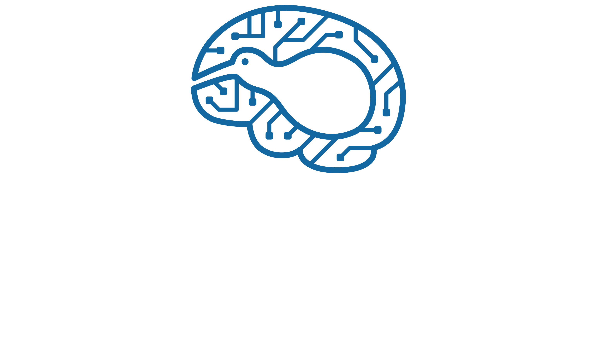

The CARES reinforcement learning bed used as the foundation for RL related projects.

## Motivation
**Reinforcement Learning Algorithms** (that is to say, *how* the Neural Networks are updated) stay the same no matter the application. This package is designed so that these algorithms are only programmed **once** and can be *"plugged & played"* into different environments.

## Usage
Consult the repository [wiki](https://github.com/UoA-CARES/cares_reinforcement_learning/wiki) for a guide on how to use the package

## Installation Instructions
If you want to utilise the GPU with Pytorch install CUDA first - https://developer.nvidia.com/cuda-toolkit

Install Pytorch following the instructions here - https://pytorch.org/get-started/locally/

`git clone` the repository into your desired directory on your local machine

Run `pip3 install -r requirements.txt` in the **root directory** of the package

To make the module **globally accessible** in your working environment run `pip3 install --editable .` in the **project root**

## Running an Example
This package serves as a library of specific RL algorithms and utility functions being used by the CARES RL team. For an example of how to use this package in your own envrionments see the example gym packages below that use these algorithms for training agents on a variety of simulated and real-world tasks. 

### Gym Environments
We have created a standardised training gym environment that wraps the most common gym environments used in reinforcement learning into a single easy to use place:  https://github.com/UoA-CARES/gymnasium_envrionments 

This package contains wrappers for the following gym environments:

#### Deep Mind Control Suite
The standard Deep Mind Control suite: https://github.com/google-deepmind/dm_control

    

#### OpenAI Gymnasium
The standard OpenAI Gymnasium: https://github.com/Farama-Foundation/Gymnasium 

    

#### Game Boy Emulator
Environment running Gameboy games utilising the pyboy wrapper: https://github.com/UoA-CARES/pyboy_environment 

    
    

### Gripper Gym
The gripper gym contains all the code for training our dexterous robotic manipulators: https://github.com/UoA-CARES/gripper_gym

    
    

### F1Tenth Autonmous Racing
The Autonmous F1Tenth package contains all the code for training our F1Tenth platforms to autonmously race: https://github.com/UoA-CARES/autonomous_f1tenth 

    

## Utilities
CARES RL provides a number of useful utility functions and classes for generating consistent results across the team. These utilities should be utilised in the new envrionments we build to test our approaches.

### configurations.py
Provides baseline dataclasses for environment, training, and algorithm configurations to allow for consistent recording of training parameters. 

### RLParser.py
Provides a means of loading enevironment, training, and algorithm configurations through command line or configuration files. Enables consistent tracking of parameters when running training on various algorithms.

### Record.py
The Record class allows data to be saved into a consistent format during training. This allows all data to be consistently formatted for plotting against each other for fair and consistent evaluation.

All data from a training run is saved into '~/cares_rl_logs'. A folder will be created for each training run named as 'seed/ALGORITHM-TASK-YY_MM_DD:HH:MM:SS', e.g. '10/TD3-HalfCheetah-v4-23_10_11_08:47:22'. This folder will contain the following directories and information saved during the training session:

