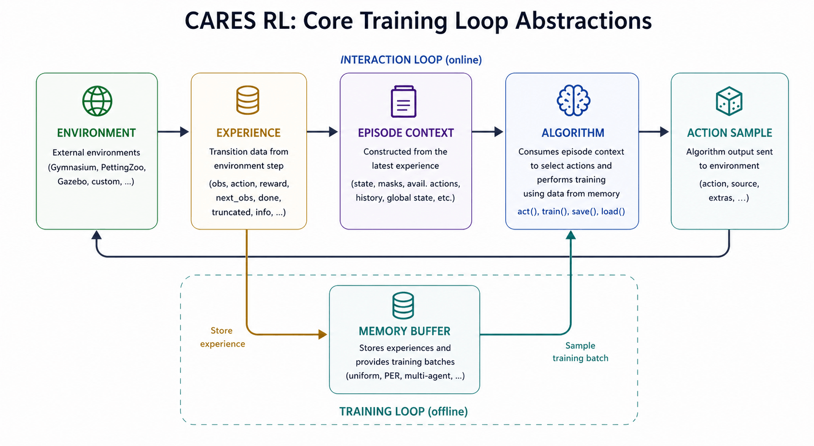

--8<-- "include/glossary.md"

# Abstractions

This page explains the core abstractions used throughout CARES Reinforcement Learning. It is intended for contributors who want to understand how the package is structured, where new components should fit, and which interfaces need to be preserved when adding or modifying functionality.

## Why These Abstractions Exist

The system is intentionally structured around a small number of shared abstractions so that algorithms, environments, and replay buffers can be developed independently while remaining compatible with the same training loop. 

Most components should not need to know the concrete implementation of the other components they interact with. For example, a training loop should not need custom logic for every algorithm, and an algorithm should not need to know whether experience came from a Gymnasium environment, a PettingZoo environment, or a custom simulator.

Instead, contributors should aim to preserve a small number of stable contracts:

- environments return standard observation and experience objects
- algorithms consume those objects through a common interface
- memory buffers store and sample experience through a common interface
- runners coordinate these components without depending on implementation details

!!! tip "Contributor mindset"
    When adding a new algorithm, environment, or replay buffer, try to make it fit the
    existing contracts before changing the runner or training loop.

    If a new feature requires changing one of these abstractions, consider whether the
    change is broadly useful across the package or specific to one implementation.

## Core Abstractions

The main training loop is built around a small number of shared abstractions. These contracts define how components interact and should remain stable as new algorithms, environments, and replay buffers are added. Contributors should aim to fit new implementations into these existing interfaces before modifying the abstractions themselves - although we are open to changes as things evolve!

!!! tip "Evolving Abstraction"
    If you look at the commit history this abstraction has evolved over time. We are open to adjusting things when required, but it must be from deep thought and not quick short-cuts. 

### Environment

The environment is responsible for interacting with the external simulator or task. This may be a Gymnasium environment, a PettingZoo environment, Gazebo simulation, or a custom environment. This interface is managed by the envrionments wrappers - full details on how to implement these are given in the [environments guide](environments.md).

Its role is to:

- reset the task
- apply actions
- return transition data via experiences
- works with observation and action spaces

The environment should expose a consistent interface regardless of the backend being used.

The goal is that algorithms should not need environment-specific logic or knowledge.

### Experience

An `Experience` represents the transition generated from an environment step.

It contains the data required for both action selection and training, such as:

- current observation
- action taken
- reward
- next observation
- done flag
- truncated flag
- additional environment information

This is the primary object passed between the environment, episode context, and memory
buffer.

For MARL methods, this may contain per-agent data as well as shared global state.

### Observations

Observations represent the state information exposed to the algorithm.

They are usually stored inside an `Experience` as the current observation and next
observation.

For single-agent methods, this may be a single vector state, image state, or combined
observation.

For multi-agent methods, observations may include per-agent observations and shared global state.

Observations should describe what the agent can use to make decisions. They should not
include training-only bookkeeping unless that information is explicitly part of the
algorithm interface.

### Episode Context

`EpisodeContext` is the abstraction used for action selection.

`EpisodeContext` is built from observations and other episode-level information required
for action selection.

This may include:

- observations
- available actions
- masks
- recurrent history
- global state
- per-agent state (MARL)

This abstraction is intentionally broader than a simple observation, as many algorithms
require more than the raw environment state to act correctly.

### Algorithm

The algorithm implements the learning logic.

All algorithms should follow the same public interface so that runners do not require
algorithm-specific logic.

This typically includes:

- `act(...)`
- `train(...)`
- `save_models(...)`
- `load_models(...)`

Examples include DQN, SAC, TD3, PPO, QMIX, and MADDPG.

The algorithm consumes `EpisodeContext`, produces `ActionSample`, and trains using
batches sampled from memory.

### Action Sample

Algorithms do not return raw actions directly.

Instead, they return an `ActionSample`, which contains:

- the selected action
- the action source (for example policy or random exploration)
- optional metadata stored in `extras`

This makes exploration behaviour explicit and keeps the training loop generic across
different algorithms.

### Memory Buffer

The memory buffer stores experiences generated during environment interaction.

Its role is to:

- store new experiences
- manage replay structure
- sample training batches for learning

This abstraction allows the same algorithm to work with:

- uniform replay
- prioritized replay
- sequence replay
- multi-agent replay buffers

The algorithm should depend on sampled batches, not on how the buffer stores them.

## Single-Agent and Multi-Agent Abstractions

Most interfaces in the codebase support both single-agent reinforcement learning
(SARL) and multi-agent reinforcement learning (MARL).

Rather than treating MARL as a completely separate system, the package uses the same
core abstractions with agent-specific extensions where needed.

This allows contributors to implement new methods while preserving a consistent training
loop.

### Single-Agent Reinforcement Learning (SARL)

SARL assumes one learning agent interacting with the environment.

This is the standard structure used by algorithms such as:

- DQN
- SAC
- TD3
- PPO

In this case:

- one observation is processed
- one action is selected
- one reward is received
- one transition is stored

The abstractions remain relatively simple because all decision-making belongs to a
single policy.

### Multi-Agent Reinforcement Learning (MARL)

MARL extends the same structure to multiple agents interacting in the same environment.

Examples include:

- QMIX
- MADDPG
- MAPPO

In this case:

- multiple agent observations may exist
- multiple actions are selected
- rewards may be individual or shared
- global state may be required for training

This introduces additional requirements such as agent indexing, shared state, and
coordination between policies.

### Shared Interface Philosophy

The goal is not to create two completely separate frameworks.

Instead:

- SARL and MARL share the same training loop structure
- algorithms still implement the same high-level interface
- environments still produce experiences
- memory buffers still store replay data

The difference is in the structure of the data being passed.

For example:

- `SARLExperience` stores one transition
- `MARLExperience` stores per-agent transitions and shared state

and similarly for:

- `SARLAlgorithm` vs `MARLAlgorithm`
- `SARLEpisodeContext` vs `MARLEpisodeContext`

This keeps the system extensible without duplicating the entire framework.

!!! tip "Contributor mindset"
    When adding a new MARL algorithm, try to extend the shared abstractions rather than
    creating special-case training loops.

    Most new functionality should be handled through richer experience and context
    objects, not runner-specific logic.

## Configuration-Driven Construction

Most components in the package are created through configuration classes rather than
being manually constructed inside training scripts.

This keeps experiments reproducible, reduces duplicated setup logic, and allows runners
to remain generic across many algorithms and environments.

The general pattern is:

1. A configuration defines parameters and architecture choices
2. A factory uses that configuration to construct the correct implementation
3. The runner interacts only with the shared abstraction, not the concrete class

This applies to:

- algorithms
- neural networks
- environments
- memory buffers
- training runners

### Why This Matters

Contributors should avoid hardcoding implementation details directly into runners or
training scripts.

Instead, new functionality should be introduced through:

- a new config
- a factory update
- a class that follows the existing abstraction

This makes new methods easier to test, compare, and maintain.

For example, adding a new algorithm should usually require:

- a new algorithm class
- a matching configuration class
- registration in the relevant factory

rather than modifying the core training loop.

!!! tip "Contributor Mindset"

    If adding a new feature requires editing multiple runners, the design likely needs to be reconsidered.
    
    In most cases, the correct solution is to extend configuration and factory logic rather than introducing algorithm-specific handling inside the training loop.

## Design Principles

The purpose of these abstractions is not only code organisation, but long-term
maintainability.

As the number of algorithms, environments, and replay systems grows, consistency becomes
more important than individual implementations.

Contributors should treat these abstractions as stable contracts that allow the package
to scale without repeatedly rewriting training infrastructure.

### Prefer Extensions Over Special Cases

New functionality should usually be added by extending an existing abstraction rather
than introducing special handling in runners or training loops.

For example:

- add a new algorithm class rather than branching inside the runner
- add a new replay buffer implementation rather than changing training logic
- add a new environment wrapper rather than environment-specific algorithm code

This keeps the package easier to test and significantly easier to maintain.

!!! tip "Design rule"
    If a feature requires multiple `if algorithm == ...` checks inside the runner,
    the abstraction probably needs improvement.

### Keep Runners Generic

Runners should coordinate training, not implement algorithm logic.

They should work with abstractions such as:

- `Algorithm`
- `Environment`
- `MemoryBuffer`
- `EpisodeContext`

rather than concrete implementations such as DQN, SAC, or QMIX.

This separation allows contributors to add new methods without rewriting the training
loop.

### Keep Data Structures Explicit

Objects such as `Experience`, `EpisodeContext`, and `ActionSample` should make data flow
clear and predictable.

Avoid hidden assumptions or implicit state where possible.

Explicit transition objects make debugging easier, simplify replay buffer design, and
reduce coupling between components.

This is particularly important for MARL methods where shared state and per-agent state
must remain easy to reason about.

### When to Change an Abstraction

Sometimes new research requires extending an existing abstraction.

Before changing a shared interface, ask:

- is this broadly useful across multiple algorithms?
- does this improve the package architecture overall?
- can this be solved inside the implementation instead?

Shared abstractions should change slowly.

Changing them should be a design decision, not a shortcut.

Contributors should optimise for consistency first and convenience second.