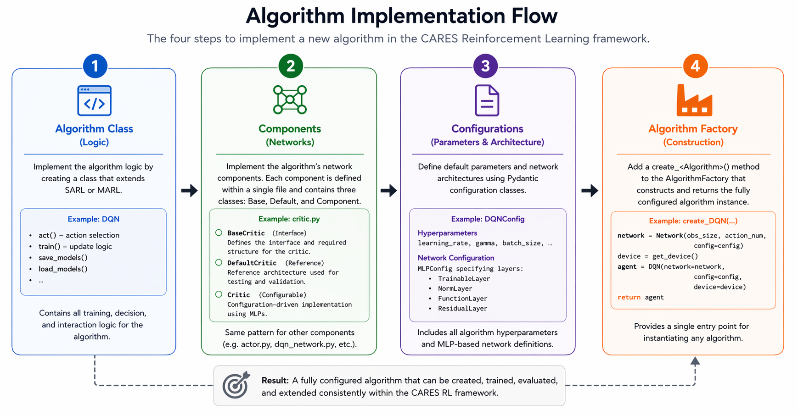

# Algorithm Contribution Guide
We are seeking published algorithms that are interesting or offer novel insights to the reinforcement learning community. Please reference the original paper or source in your pull request, and document any deviations or improvements made during your implementation. These instructions explain how to create a new algorithm within our code base - specific details on code abstraction logic can be found in the [abstractions](./abstractions.md) portion of the developers guide.


At a high level: *configuration defines structure, components implement structure, and the algorithm consumes those components to learn.*

## Replication Philosophy
Our goal is to faithfully replicate these algorithms with best intentions against the original publications. We recognize that achieving a perfect, byte-for-byte replication of published algorithms is often not possible due to differences in frameworks, environment versions, or unavailable implementation details. When contributing, please aim to capture the original intent and core mechanisms of the algorithm as faithfully as possible. If you make design decisions—such as modernizing components for compatibility, optimizing for efficiency, or improving consistency with current best practices—clearly document these choices and the reasoning behind them in your code and pull request. This transparency helps maintain the integrity of benchmarking and ensures that others can understand and reproduce your results.


## Implementation Steps
To implement a new algorithm in the CARES Reinforcement Learning package you need to follow four steps:

1. Create the Algorithm class that contains all algorithm logic in the [algorithm folder](https://github.com/UoA-CARES/cares_reinforcement_learning/tree/main/cares_reinforcement_learning/algorithm). This class will contain all the training and decision logic for the algorithm.
2. Create the Components for the algorithm that defines the algorithms networks in the [networks folder](https://github.com/UoA-CARES/cares_reinforcement_learning/tree/main/cares_reinforcement_learning/networks). This folder will define all the networks the algorithm requires e.g. Actor and Critic.
3. Define the default parameter and network configurations for the algorithm in the [configurations file](https://github.com/UoA-CARES/cares_reinforcement_learning/blob/main/cares_reinforcement_learning/algorithm/configurations.py). This configuration will store the default values for all parameters used by the algorithm (e.g. learning rate) and define the default network architectures (e.g. hidden layer sizes).
4. Define the Constructor method for the Algorithm in the [AlgorithmFactory](https://github.com/UoA-CARES/cares_reinforcement_learning/blob/main/cares_reinforcement_learning/algorithm/algorithm_factory.py).

This design separates algorithm logic, network structure, and configuration, enabling modular development, reproducibility, and flexible experimentation without modifying core code. 

## 1. Create the Algorithm Class
Place your new algorithm in the appropriate subfolder under the primary algorithms folder [here](https://github.com/UoA-CARES/cares_reinforcement_learning/tree/main/cares_reinforcement_learning/algorithm) (e.g., `policy/`, `value/`, or `usd/`). If the algorithm doesn't fit into these categories (e.g. Model-Based RL) then create a new folder that effectively categorizes it. We currently have implementations that loosely fall into the three categories below: 

- **Value**: Q-Learning based algorithms (e.g. DQN) - [here](https://github.com/UoA-CARES/cares_reinforcement_learning/tree/main/cares_reinforcement_learning/algorithm/value)
- **Policy**: Policy gradient and Actor/Critic based methods (e.g. SAC, TD3) - [here](https://github.com/UoA-CARES/cares_reinforcement_learning/tree/main/cares_reinforcement_learning/algorithm/policy).
- **USD**: Unsupervised Skill Discovery methods (e.g. DIAYN) - [here](https://github.com/UoA-CARES/cares_reinforcement_learning/tree/main/cares_reinforcement_learning/algorithm/usd)

### Algorithm Interface
Your algorithm should extend from either `SARL` (Single-Agent RL) or `MARL` (Multi-Agent RL) and define the action type as continuous (`np.ndarray`) or discrete (`int`), depending on the type of algorithm it is. The key public methods to implement are `train`, `save_models`, `load_models`, and `act` for the algorithm. Other optional class functions for interaction with the training loops can be found in the base algorithm interface where relevant for the given algorithm. You can find the base Algorithm and SARL/MARL interfaces in the [algorithm.py](https://github.com/UoA-CARES/cares_reinforcement_learning/blob/main/cares_reinforcement_learning/algorithm/algorithm.py) file for reference. 

These interfaces also define the expected Observation and action data for the algorithm - the environment wrappers enforce these data types for consistency across the all the gym environments. The implementation details for the overall package typing can be found [here](https://github.com/UoA-CARES/cares_reinforcement_learning/tree/main/cares_reinforcement_learning/types). These types generalise beyond just the standard Openai Gym and PettingZoo abstractions and enable handling of multi-agent algorithms in the same code abstraction. 

The parameter configurations for the algorithm are provided via the corresponding `AlgorithmConfig` (e.g. `DQNConfig`) pydantic data class. This is explained further in step 3. 

### Example: DQN Algorithm
Below is a minimal example of the public interface for DQN using the algorithm base class to work into the training/evaluation loop. The full implementation of DQN in our format can be found [here](https://github.com/UoA-CARES/cares_reinforcement_learning/blob/main/cares_reinforcement_learning/algorithm/value/DQN.py). 

```python
from cares_reinforcement_learning.algorithm.algorithm import SARLAlgorithm
from cares_reinforcement_learning.types.observation import SARLObservation
from cares_reinforcement_learning.memory.memory_buffer import SARLMemoryBuffer
from cares_reinforcement_learning.algorithm.configurations import DQNConfig

# Instantiated as a Single-Agent Reinforcement Learning algorithm with discrete Actions
class DQN(SARLAlgorithm[int]): 

    # The algorithm takes in the networks/actor/critic/encoders externally to enable variations of network architecture design.
    # The configuration passes all algorithm parameters - e.g. learning rate etc.
    def __init__(
        self,
        network: BaseNetwork,
        config: DQNConfig,
        device: torch.device,
    ):
        # Sets the policy type for reference to the training loops
        super().__init__(policy_type="value", config=config, device=device)
        
        # Setup and configure DQNs network and Target Network
        self.network = network.to(device)
        self.target_network = copy.deepcopy(self.network).to(device)
        self.target_network.eval()

        # Here you would unpack the configurations from the DQNConfig etc
        ...

    # Implement the action selection method for the algorithm - the observation type contains all relavent metrics an algorithm may require beyond just the current state
    def act(
        self,
        # Single Agent algorithm so handles the SARLObservation type
        observation: SARLObservation,
        evaluation: bool = False,
    ) -> ActionSample[int]: ...

    # Implement the update method for the algorithm from the current memory and episode context - which contains details about the training iteration and episode count.
    def train(
        # Single Agent algorithm so handles the SARLMemoryBuffer type
        self, memory_buffer: SARLMemoryBuffer, episode_context: EpisodeContext
    ) -> dict[str, Any]: ...

    # Save and load methods for the algorithm - saving networks and current parameter values for reloading to a given state
    def save_models(self, filepath: str, filename: str) -> None: ...
    def load_models(self, filepath: str, filename: str) -> None: ...

```

## 2. Create the Components
Implementations for an Algorithms required neural network components go into the networks folder [here](https://github.com/UoA-CARES/cares_reinforcement_learning/tree/main/cares_reinforcement_learning/networks) (e.g. [network/DQN](https://github.com/UoA-CARES/cares_reinforcement_learning/tree/main/cares_reinforcement_learning/networks/DQN)). Each algorithm gets its own folder for its component implementations.

For each network component in an algorithm (e.g. actor, critic, or encoder), the CARES Reinforcement Learning codebase typically defines three classes: `Base`, `Default`, and `Component`. If your algorithm requires multiple network components (e.g. actor and critic networks), create a dedicated file for each component separately (e.g `actor.py` and `critic.py`). The naming conventions must follow the format of: `BaseComponent`, `DefaultComponent`, and `Component`.

- The `Base` provides the shared interface and core forward-pass behaviour for the component, ensuring consistency across implementations. This defines the modules and their interactions required for the algorithm to function. 
- The `Default` defines the reference architecture for the modules used by the framework by default, which is important for both clarity and automated testing, as it allows us to verify that default configurations produce the intended structure through automated testing. 
- The `Component` class represents the configurable implementation used in practice by the code, constructing each component using the configuration-driven `MLP` class [here](https://github.com/UoA-CARES/cares_reinforcement_learning/blob/main/cares_reinforcement_learning/networks/mlp_architecture.py).

This separation allows automated tests to verify that the default configuration always produces the expected network structure, preventing accidental changes to layer sizes or architecture. 

The `MLP` class provides a flexible way to construct modules within a network component. Instead of hardcoding architectures, modules are defined through configuration files, allowing layer sizes, activations, and structure to be adjusted without changing code. This enables network components to remain consistent while supporting fully configurable internal architectures. The full description of how the `MLP` class works is provided in the [abstractions](./abstractions.md) portion of the wiki. How to define the modules with the algorithms config class is explained in step 3.

Within a component, the architecture may be composed of multiple internal modules. These modules represent smaller functional building blocks, such as shared feature extractors, value and advantage heads, or separate policy and value branches. These components each make up their own separate module in the overall network. See [dueling DQN](https://github.com/UoA-CARES/cares_reinforcement_learning/blob/main/cares_reinforcement_learning/networks/DuelingDQN/network.py) how this works. Each internal module may have its own `MLPConfig` definition. 

You may also extend an existing base network or import one directly if it will reuse the base components of an existing algorithm. In some cases only the `default` network may be instantiated to indicate the difference in the default network configuration. In these cases the base `<Algorithm>Config` will need to extend from the existing algorithms configuration. See [PERSAC](https://github.com/UoA-CARES/cares_reinforcement_learning/tree/main/cares_reinforcement_learning/networks/PERSAC) as an example of providing a pass through to the base SAC actor and critic components.

### Example: DQN Network
Below is an example of the basic boilerplate for the DQN network structure for the DQN algorithm (e.g. `network.py`). The full implementation of the DQN network in our format can be found [here](https://github.com/UoA-CARES/cares_reinforcement_learning/tree/main/cares_reinforcement_learning/networks/DQN).

- The base network class (`BaseDQN`) provides a common interface for how the networks modules related, in this instance a very straightforward case with only a single module. 
- The `DefaultNetwork` class implements the reference architecture with fixed layer sizes and activations, matching the default configuration parameters.  
- The `Network` class is the primary component used in practice and is constructed based on the user-provided configuration, allowing for flexible customization through the `MLP` class that is configured through the algorithms configuration `DQNConfig`.

```python
# Base class for extensions to DQN to extend
class BaseDQN(nn.Module):
    def __init__(
        self,
        observation_size: int,
        num_actions: int,
        network: nn.Module,
    ):
        self.observation_size = observation_size
        self.num_actions = num_actions

        # DQN is straightforward a single module (network)
        self.network = network

    def forward(self, state: torch.Tensor) -> torch.Tensor:
        # Straight forward passing of the state through the network
        output = self.network(state)
        return output


# This is the default base network for DQN for reference
class DefaultNetwork(BaseDQN):
    def __init__(
        self,
        observation_size: int,
        num_actions: int,
    ):
        hidden_sizes = [64, 64]

        # A Sequential structure defines the default network that is expected for DQN. 
        # #Note - we are targeting non-image based states so no CNN layers
        network = nn.Sequential(
            nn.Linear(observation_size, hidden_sizes[0]),
            nn.ReLU(),
            nn.Linear(hidden_sizes[0], hidden_sizes[1]),
            nn.ReLU(),
            nn.Linear(hidden_sizes[1], num_actions),
        )
        super().__init__(
            observation_size=observation_size, num_actions=num_actions, network=network
        )


class Network(BaseDQN):
    def __init__(self, observation_size: int, num_actions: int, config: DQNConfig):
        # The network piece is constructed by our configurable MLP class 
        network = MLP(
            input_size=observation_size,
            output_size=num_actions,
            config=config.network_config,
        )
        super().__init__(
            observation_size=observation_size, num_actions=num_actions, network=network
        )
```

## 3. Define Default Configurations
The configuration file contains all the default configuration parameters for the algorithms and defines the algorithms network architectures through the MLP class. The configurations are a `pydantic` data class for each algorithm. Default parameters should be chosen based on the original paper details where possible but adjustments can be made to meet modern research standards or expectations of baseline defaults. 

Create the default configuration for your algorithm in the [configurations](https://github.com/UoA-CARES/cares_reinforcement_learning/blob/main/cares_reinforcement_learning/algorithm/configurations.py) file found under `algorithm/configurations.py`. The naming convention follows `NameConfig`. This naming convention match is used by the automated tools for instantiating the algorithms and populating the command line tool parameter reader [rl_parser.py](https://github.com/UoA-CARES/cares_reinforcement_learning/blob/main/cares_reinforcement_learning/util/rl_parser.py). 

The configuration must extend the `AlgorithmConfig` base configuration that shares the basic learning parameters for the algorithms - these are the minimum expected by the training loops. If the method is an extension to an existing algorithm you can extend the base class of that algorithm's configuration to inherit the same parameter configurations. See `PERSACConfig` and `SACConfig` as an example of this in the configurations file. You can override the base defaults within the specific configuration for the new algorithm.  

The required configuration parameter `algorithm` must follow the naming convention of the algorithm class to enable the automated configuration handler to find the algorithm - (e.g. DQN -> DQNConfig -> `algorithm: str = "DQN"`).

### Component Configuration
Network components are configured through the `MLPConfig` data class which defines the internal architectures of each component. Rather than hardcoding network structures, each component (e.g. actor, critic, or DQN) receives an `MLPConfig` that specifies how its internal modules should be constructed. This instantiates the generic and configurable Multi-Layer Perceptron class: [MLP](https://github.com/UoA-CARES/cares_reinforcement_learning/blob/main/cares_reinforcement_learning/networks/mlp_architecture.py).  

An `MLPConfig` defines a sequence of layers with their default configurations (e.g. `linear` in_features=64 and out_features=64). This allows complex architectures to be expressed as simple configuration objects, which are then interpreted by the `MLP` class to build the corresponding PyTorch modules.

The supported layer abstractions that are used to construct an `MLP` are:

- **TrainableLayer**:  
  Represents a learnable layer with parameters, such as `Linear` or custom layers like `NoisyLinear`. These correspond to standard `nn.Module` layers in PyTorch that contain weights and are updated during training.

- **NormLayer**:  
  Represents normalisation layers (e.g. `LayerNorm`, `BatchNorm1d`, or `BatchRenorm1d`) that stabilise training by normalising activations. These are non-trainable in structure but may contain internal parameters (e.g. scale and shift).

- **FunctionLayer**:  
  Represents parameter-free operations such as activation functions (`ReLU`, `Tanh`, `Sigmoid`) or other functional transformations (e.g. `Dropout`). These modify the data but do not define learnable weights.

- **ResidualLayer**:  
  Represents a residual block, where an input is passed through a sequence of layers (the “main path”) and then combined with a shortcut connection. This follows the standard residual connection pattern (`output = f(x) + x`), enabling deeper and more stable architectures. Internally, this is implemented as a nested MLP with an optional learnable shortcut.

This design enables fully configurable network components: the overall structure of a component can be modified through configuration files. As a result, changing architectures (e.g. depth, width, activations, or adding residual connections) requires no code changes — only updates to the launch configuration files.

### Example: DQN Configuration
The configuration for DQN is shown below - defining the default values for the algorithm and component structure. 

```python
# The name of the config must follow the naming convention AlgorithmConfig
class DQNConfig(AlgorithmConfig):
    # Match the algorithm parameter to the data class name
    algorithm: str = "DQN"

    # Basic parameter defaults for DQN algorithm
    lr: float = 1e-3
    gamma: float = 0.99
    tau: float = 1.0

    batch_size: int = 32

    target_update_freq: int = 1000

    max_grad_norm: float | None = None

    # Exploration via Epsilon Greedy
    max_steps_exploration: int = 0
    start_epsilon: float = 1.0
    end_epsilon: float = 1e-3
    decay_steps: int = 100000

    # Network configuration for DQN here we define the equivalent of:
    # network = nn.Sequential(
    #         nn.Linear(observation_size, hidden_sizes[0]),
    #         nn.ReLU(),
    #         nn.Linear(hidden_sizes[0], hidden_sizes[1]),
    #         nn.ReLU(),
    #         nn.Linear(hidden_sizes[1], num_actions),
    #     )
    network_config: MLPConfig = MLPConfig(
        layers=[
            TrainableLayer(layer_type="Linear", out_features=64),
            FunctionLayer(layer_type="ReLU"),
            TrainableLayer(layer_type="Linear", in_features=64, out_features=64),
            FunctionLayer(layer_type="ReLU"),
            TrainableLayer(layer_type="Linear", in_features=64),
        ]
    )
```

## 4. Define the Constructor
The final step is to register the algorithm within the factory by implementing a `create_<Algorithm>` method. This method is responsible for constructing the full algorithm instance by combining the configured network components with the algorithm logic.

Each `create_<Algorithm>` function follows a consistent pattern: it instantiates the required network components (e.g. actor, critic, or value network) using the provided configuration, determines the appropriate device, and then passes these components into the algorithm class. This ensures that all algorithms are created in a standardised and reproducible way. This also facilitates the automated testing of the code base.

The [AlgorithmFactory](https://github.com/UoA-CARES/cares_reinforcement_learning/blob/main/cares_reinforcement_learning/algorithm/algorithm_factory.py) then dynamically selects the correct creation method based on the `algorithm` field in the configuration, allowing new algorithms to be integrated simply by defining their configuration and corresponding factory method. This design keeps the system modular and extensible, while maintaining a single entry point for constructing fully configured agents.

### Example DQN
The `create_DQN` method is shown below - the method creates the `Network` with the environments `observation_size` and `action_num` and passes it into the `DQN` algorithm.  

```python
def create_DQN(observation_size, action_num, config: acf.DQNConfig):
    from cares_reinforcement_learning.algorithm.value import DQN
    from cares_reinforcement_learning.networks.DQN import Network

    network = Network(observation_size["vector"], action_num, config=config)

    device = hlp.get_device()
    agent = DQN(network=network, config=config, device=device)
    return agent
```

## Overall Summary
Implementing a new algorithm in the CARES Reinforcement Learning framework follows a modular and structured workflow:

1. Define the algorithm logic by implementing the core training and decision-making behaviour.
2. Implement the required network components, separating interface (`Base`), reference architecture (`Default`), and configurable implementation (`Component`).
3. Specify all parameters and network architectures through configuration classes, enabling reproducible and fully configurable experiments.
4. Register the algorithm in the factory, providing a single entry point for constructing the fully configured agent.

This design cleanly separates concerns between logic, structure, and configuration. As a result, new algorithms can be added with minimal changes to the existing codebase, while supporting flexible experimentation, consistent interfaces, and automated validation of default behaviours.

