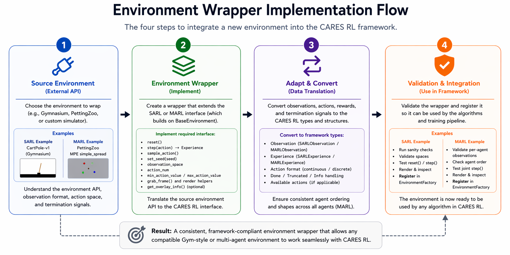

# Create the Environment Wrapper { #environment-guide }

To integrate a new environment into the CARES Reinforcement Learning framework, create an environment wrapper that adapts the source environment to the framework’s standard interface. The wrapper should follow either the `SARL` or `MARL` environment interface, both of which build on the shared `BaseEnvironment` abstraction. This ensures that all environments expose a consistent set of methods and metadata to the training loops, regardless of whether they originate from Gymnasium, PettingZoo, or another simulator.

The purpose of the wrapper is not to mirror the external API exactly, but to translate it into the observation, action, and experience types expected by the CARES RL algorithms - the base interface for all wrappers is through the [BaseEnvironment][base-env-code]. In practice, this means converting the raw outputs of the environment into the framework’s `Observation` and `Experience` [types][types-code], while also exposing properties such as `observation_space`, `action_num`, action bounds, and action sampling through a common interface. The base environment defines the required methods, including `reset`, `step`, `sample_action`, `set_seed`, `grab_frame`, and rendering-related helpers, which all wrappers must implement or override as needed.



## Wrapper Responsibilities

The environment wrappers are meant to be a lightweight conversion from the third-party environment data types and interfaces to the CARES Reinforcement Learning interface and data types. The additional types introduced in this package are to enable additional clarity about data handling and passing through the Algorithms in our library - improving type hinting and readability. Full details on the overall abstractions can be found in the [abstractions](./abstractions.md) documentation. 

A wrapper is responsible for three main tasks:

1. Adapting the source environment API to the framework [interface](https://github.com/UoA-CARES/cares_reinforcement_learning/blob/main/cares_reinforcement_learning/envs/base_environment.py).
2. Converting environment outputs into the framework’s standard observation and experience [types](https://github.com/UoA-CARES/cares_reinforcement_learning/tree/main/cares_reinforcement_learning/types).
3. Providing the metadata required by the algorithms and training loops in a consistent format.

For single-agent environments, this means wrapping the task as a [SARL](https://github.com/UoA-CARES/cares_reinforcement_learning/blob/main/cares_reinforcement_learning/envs/sarl/sarl_environment.py) environment with a single observation and action interface. For multi-agent environments, the wrapper must instead follow the [MARL](https://github.com/UoA-CARES/cares_reinforcement_learning/blob/main/cares_reinforcement_learning/envs/marl/marl_environment.py) structure, preserving agent ordering and returning observations, actions, and transition data in a way that is consistent across all agents. This is especially important because the framework uses the environment wrappers to enforce the expected typing and structure used by the algorithms.

### Base Environment Interface

The SARL and MARL interfaces ultimately inherit from [BaseEnvironment](https://github.com/UoA-CARES/cares_reinforcement_learning/blob/main/cares_reinforcement_learning/envs/base_environment.py), which defines the shared contract across environment types. At minimum, every wrapper is expected to implement a public:

- `reset` to initialise the environment and return the initial observation.
- `step` to apply an action and return an `Experience` object containing the transition information.
- `sample_action` to sample a valid action from the environment.
- `set_seed` to ensure reproducibility.
- `observation_space`, `action_num`, `min_action_value`, and `max_action_value` to expose the action and observation definitions expected by the framework.
- `grab_frame` and optionally `get_overlay_info` for rendering and visualisation support. 

The shared `BaseEnvironment` provides the rendering interface through `render()` and `grab_frame()`, where `render()` calls `grab_frame()` and displays the result using OpenCV. This allows wrappers to standardise how image observations and visual debugging are handled without exposing simulator-specific rendering logic to the algorithms. 

#### SARL Environment
Single agent environments (e.g. [OpenAI Gymnasium](https://gymnasium.farama.org/index.html), and [Deep Mind Control Suite](https://github.com/google-deepmind/dm_control)) are designed for single agent algorithms (e.g DQN and SAC).

```python
from cares_reinforcement_learning.envs.base_environment import BaseEnvironment
from cares_reinforcement_learning.types.observation import SARLObservation
from cares_reinforcement_learning.types.experience import SingleAgentExperience

class ExampleSARLEnvironment(BaseEnvironment[SARLObservation]):
    def __init__(self, config, seed: int):
        super().__init__(config=config, seed=seed)

        # Create the environment as per normal here
        self.env = ...

    # returns vector_state, reward, done, truncated, info 
    def _step(self, action: np.ndarray) -> tuple:
        ...

    # returns vector_state
    def _reset(self, training: bool = True) -> np.ndarray:
        ...

    # returns a valid action - discrete (int) or continuous (np.ndarray)
    def sample_action(self) -> int  | np.ndarray:
        ...

    # the size of the vector_state
    def _vector_space(self) -> int:
        ...
```

#### Marl Environment
The multi-agent environments (e.g [MPE2](https://mpe2.farama.org/index.html)) are designed for multi-agent algorithms (e.g. MADDPG). 

```python
class ExampleMARLEnvironment(BaseEnvironment[MARLObservation]):
    def __init__(self, config, seed: int):
        super().__init__(config=config, seed=seed)

        # Create the environment as per normal here
        self.env = ...

    def step(self, action: list[int] | list[np.ndarray]) -> MultiAgentExperience:
        ...

    def reset(self, training: bool = True) -> MARLObservation:
        ...

    def sample_action(self) -> list[int] | list[np.ndarray]:
        ...

    def observation_space(self) -> dict[str, Any]:
        ...
```

### Design Guidance

When implementing a wrapper, keep the framework-facing interface as clean and stable as possible. The algorithms should not need to know whether the underlying environment comes from Gymnasium, PettingZoo, or a custom simulator. All source-specific details should be handled inside the wrapper. This separation keeps the training code independent of the simulator backend and allows new environments to be added without modifying the algorithms or training loops themselves. This follows the same overall framework design used elsewhere in CARES RL, where abstractions are used to separate implementation details from the interfaces consumed by the rest of the codebase. 

### Summary

An environment wrapper serves as the translation layer between an external environment API and the CARES RL framework. By implementing the `SARL` or `MARL` interface on top of `BaseEnvironment`, the wrapper standardises how observations, actions, rewards, and transitions are represented. This allows the training loops and algorithms to interact with all environments through one consistent abstraction, making the framework easier to extend across different environment backends. 

--8<-- "include/links.md"