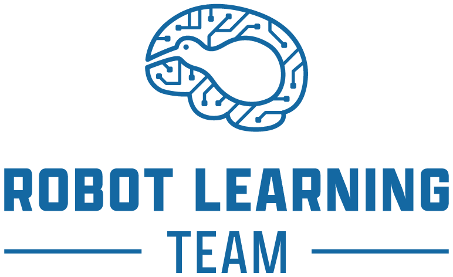

    

# CARES Reinforcement Learning
Welcome to the CARES Reinforcement Learning library created by the [Robot Learning Team](https://robotlearningteam.org/). 

The CARES Reinforcement Learning package is a modular and extensible framework for developing, training, and evaluating reinforcement learning algorithms. It provides a consistent interface across value-based, policy-based, and multi-agent methods, enabling clear comparisons between approaches in a single code base. Designed with research and real-world robotics applications in mind. This code base has been designed for the local team but we feel it has utility beyond our research group and are open to contributions/suggestions from others. 

## Reinforcement Learning Wiki
Under Development

## User Guide
This section provides practical guidance on using the CARES Reinforcement Learning framework. It covers installation, environment setup, training workflows, and configuration options, helping you quickly run and evaluate experiments. Whether you're getting started or refining your setups, these guides focus on how to effectively use the framework in practice.

## Developer Guide
This section provides a comprehensive overview of the CARES Reinforcement Learning framework, including its architecture, core abstractions, and development patterns. It outlines how the codebase is structured, the conventions used throughout, and how components interact. Whether you're extending existing functionality or implementing new algorithms, these guides are designed to help you navigate the system and develop within it effectively.

