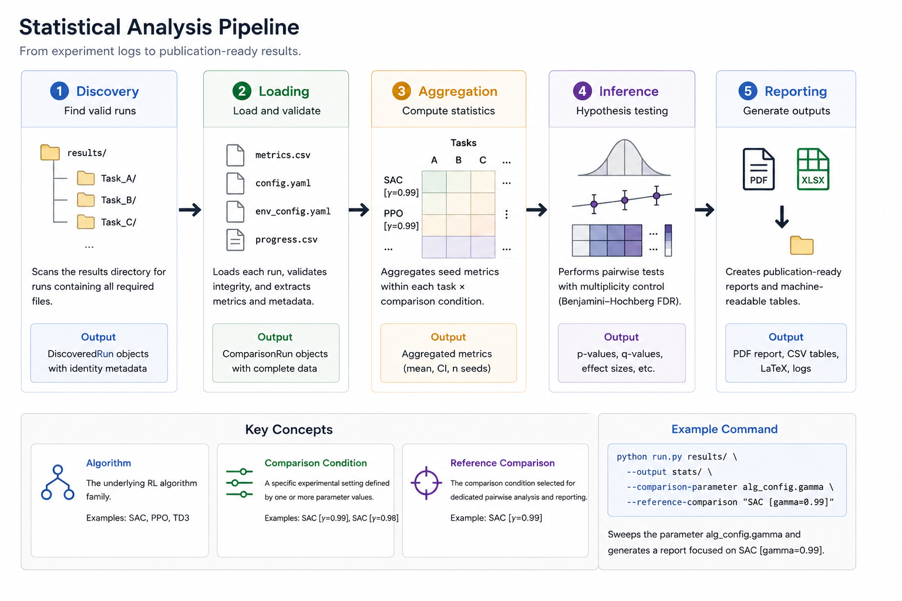

--8<-- "include/glossary.md"

# CARES RL Statistical Tool

The CARES RL Statistical Tool produces publication-ready statistical summaries from reinforcement-learning evaluation logs. It supports both standard algorithm benchmarks and configuration-based comparison studies such as ablations and parameter sweeps.



!!! note "Statistical Philosophy"
    The tool prioritises robust effect estimation over binary hypothesis testing. The recommended interpretation sequence is:

    1. Estimate the effect.
    2. Quantify uncertainty.
    3. Compare methods directly.
    4. Use significance tests as supplementary evidence.

## Quick Start

The CARES RL Statistical Tool supports three common analysis workflows:

### Standard multi-algorithm benchmark

Use this workflow when comparing different reinforcement learning algorithms (e.g. SAC, PPO, TD3) where each algorithm represents a unique comparison condition. The reference comparison specifies the algorithm highlighted in the dedicated pairwise analysis (your novel algorithm or contribution).

```bash
cares-rl-stats benchmark_root \
    --output results \
    --reference-comparison SAC
```

### Parameter sweep or ablation
Use this workflow when comparing multiple variants of the same algorithm. Specify one or more configuration parameters that distinguish the experimental conditions, then select the reference comparison using its generated comparison label.

```bash
cares-rl-stats benchmark_root \
    --output results \
    --comparison-parameter alg_config.gamma \
    --reference-comparison "SAC [gamma=0.99]"
```

!!! note "Comparison parameter"
    Use `--comparison-parameter` only for configuration values that actually distinguish the experimental conditions. It may be supplied repeatedly when more than one parameter changes.

### Single task
Use this workflow to analyse a single environment or task. The tool computes per-task performance statistics, confidence intervals, significance tests, and publication-ready outputs, but does not perform cross-task aggregation or benchmark-wide comparisons.

```bash
cares-rl-stats walker_walk --output results
```

