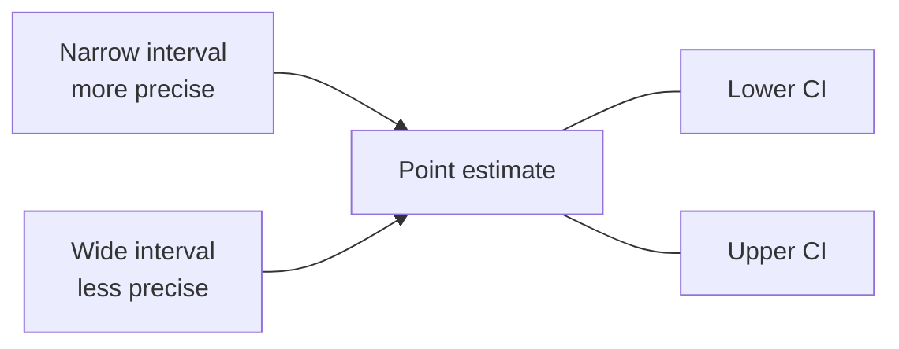
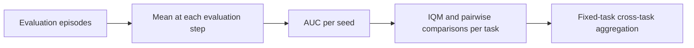

--8<-- "include/glossary.md"

# Statistical Methodology

This page documents the calculations used by the tool and the interpretation of the statistical outputs.

!!! note "Terminology"

    Statistics are grouped by **comparison condition**. In a standard benchmark, a comparison condition normally corresponds to one algorithm. In an ablation or parameter sweep, several comparison conditions may share the same underlying algorithm and differ only through selected configuration parameters.

!!! warning "Primary evidence"

    The primary evidence is based on effect estimates and uncertainty: IQM, bootstrap confidence intervals, probability of improvement, and mean superiority. Friedman, Nemenyi, and critical-difference outputs are supplementary rank analyses.


## Methodology Summary

### Within each seed

1. Group evaluation episodes by `total_steps`.
2. Average the selected metric at each step.
3. Calculate trapezoidal full, early-window and final-window AUC.

### Within each task

1. Treat seed AUCs as independent run outcomes.
2. Calculate IQM, mean, standard deviation, range and rank.
3. Calculate a BCa bootstrap interval for IQM by resampling seeds.
4. Calculate pairwise probability of improvement using all cross-condition seed pairs.
5. Calculate Cliff's delta.
6. Retain a paired Wilcoxon test for matched seed IDs or Mann–Whitney U when unmatched seeds are explicitly enabled.
7. Apply Holm correction within each metric family.

### Across fixed benchmark tasks

1. Give every task equal weight.
2. Do not pool or average raw metric magnitudes across tasks.
3. Calculate task superiority from pairwise probabilities against all opponents.
4. Average task superiority to obtain mean superiority.
5. Estimate superiority uncertainty by holding tasks fixed and resampling seeds within each task.
6. Calculate average rank, rank spread and Top-k summaries.
7. Calculate direct cross-task pairwise probabilities and their fixed-task stratified intervals.
8. Retain Friedman and conditional Nemenyi analyses as supplementary rank checks.

!!! important "Fixed-task interpretation"
    Cross-task intervals quantify run-to-run uncertainty for the benchmark that was actually selected. They do not claim that the benchmark tasks are a random sample from every possible environment.

### Publication hierarchy

**Primary:**

- pairwise probability of improvement;
- confidence interval;
- reference-comparison W-T-L record;
- mean superiority for roster-wide summary.

**Supporting:**

- task IQM and BCa interval;
- average rank and rank dispersion;
- Top-k counts.

**Supplementary:**

- Wilcoxon/Mann–Whitney outputs;
- Holm-adjusted p-values;
- Friedman test;
- Nemenyi comparison and critical-difference diagram.


## Statistical Measures

### Full, early and final AUC

The mean evaluation value at each step forms a curve. The tool integrates that curve using the trapezoidal rule.

- **Full AUC** measures performance across the complete training process.
- **Early-window AUC** emphasises early sample efficiency.
- **Final-window AUC** emphasises late-stage or converged performance.

!!! warning
    AUCs from different training horizons or step grids are not directly comparable. The validation layer prevents these mismatches within a task.

### Interquartile mean

IQM is the mean of the central 50% of observations. It is robust to unusually poor or unusually strong seeds.

### BCa bootstrap confidence interval

Per-task IQM intervals use the bias-corrected and accelerated bootstrap with seed as the resampling unit.



<p class="figure-caption">A narrow interval indicates greater precision. Overlap with a reference value means the direction remains uncertain at the chosen confidence level.</p>

### Probability of improvement

For candidate values `C` and baseline values `B`:

```text
P(candidate better) = [wins + 0.5 × ties] / all candidate–baseline pairs
```

For a lower-is-better metric, the comparison direction is reversed automatically.

### Cliff's delta

Cliff's delta is the signed transformation:

```text
δ = 2 × P(candidate better) - 1
```

- `+1`: every candidate run is better.
- `0`: equal distributional tendency.
- `-1`: every candidate run is worse.

Because it is a direct transformation of probability of improvement, it contains the same ordering information on a different scale.

### Mean superiority

For each task, an condition's pairwise probabilities against all opponents are averaged. These task-level superiority values are then averaged across tasks.

Mean superiority is scale-free but roster-dependent.

### Rank measures

- **Average rank:** mean rank across tasks.
- **Rank SD:** standard deviation of task ranks.
- **Rank IQR:** middle 50% spread of task ranks.
- **Top-k rate:** proportion of tasks on which the comparison condition placed within the top k.

Ranks describe ordering and consistency, not effect magnitude.

### Wilcoxon and Mann–Whitney outputs

The raw task outputs retain:

- paired Wilcoxon signed-rank tests when seed IDs match;
- Mann–Whitney U tests when unmatched seeds are explicitly allowed.

The raw cross-task pairwise output also retains a Wilcoxon test on paired task ranks. These p-values are supplementary and are deliberately excluded from the publication-focused cross-task pairwise table.

!!! important
    The primary interpretation should remain effect size plus confidence interval, not whether a p-value crosses 0.05.

### Holm correction

When multiple p-values belong to the same evaluation-metric/performance-summary family, Holm correction controls family-wise error more strongly than interpreting every unadjusted p-value independently.

### Friedman test

The Friedman test asks whether at least one condition's rank distribution differs across tasks. It requires at least three comparison conditions and two tasks.

It does not identify which conditions differ.

### Nemenyi post-hoc comparison

Nemenyi comparisons are generated only after a significant Friedman test for the same metric group. Two average ranks are marked different when their separation exceeds the critical difference.

!!! warning
    Friedman and Nemenyi use ranks. They should be presented as supplementary consistency analysis, not as the primary evidence for a reference comparison.


## Output Schema

### `seed_metrics.csv`

One row per comparison condition, seed, evaluation metric and performance summary.

Key fields include:

- `algorithm`
- `seed`
- `evaluation_metric`
- `direction`
- `performance_metric`
- `value`

### `algorithm_summary.csv`

Per-task comparison condition summaries for every evaluation metric and AUC summary.

Typical fields include IQM, BCa interval, mean, standard deviation, minimum, maximum, seed count and rank.

### `pairwise_comparisons.csv`

Per-task pairwise results, including test information, probability of improvement and Cliff's delta.

Orientation follows the stored `algorithm_a` and `algorithm_b` columns. Inspect the probability column name before interpreting direction.

### `benchmark_summary.csv`

One row per comparison condition, evaluation metric and performance summary.

Contains mean superiority and its interval, rank summaries, Top-k counts/rates and bootstrap metadata.

### `cross_task_pairwise.csv`

Complete pairwise benchmark output, including:

- W-T-L task counts;
- mean probability that comparison condition A is better;
- fixed-task stratified bootstrap interval;
- mean and median rank differences;
- supplementary task-rank Wilcoxon result;
- Holm-adjusted p-value.

### `reference_comparison.csv`

Reorients the pairwise benchmark output so the named reference comparison is always the focal condition.

Key columns:

- `reference_comparison`
- `comparator`
- `probability_reference_better`
- confidence interval bounds
- tasks won, tied and lost
- `ci_supports_advantage`
- `ci_supports_disadvantage`

!!! tip
    Use this file for the main reference-comparison table in a paper.


## Evidence Hierarchy

The analysis operates at three levels.

| Level | Main question | Primary output |
|---|---|---|
| Seed | How did one trained run behave over time? | Full, early and final AUC |
| Task | How does a comparison condition perform on one environment? | IQM with BCa CI; pairwise probability of improvement |
| Benchmark | How consistently does it perform across environments? | Mean superiority; direct cross-task probability of improvement |



### Evidence hierarchy

1. **Direct probability of improvement and its CI** for a named comparison.
2. **Mean superiority and its CI** for a benchmark-wide overview.
3. **Per-task IQM and its CI** for task-specific performance.
4. **Average rank, rank spread and Top-k counts** for consistency.
5. **Friedman and Nemenyi** as supplementary rank-based checks.

!!! note
    No single statistic answers every question. A good conclusion combines magnitude-free pairwise evidence, uncertainty, task-level performance and consistency.

--8<-- "include/links.md"