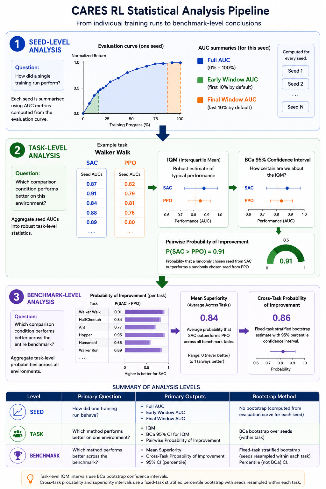
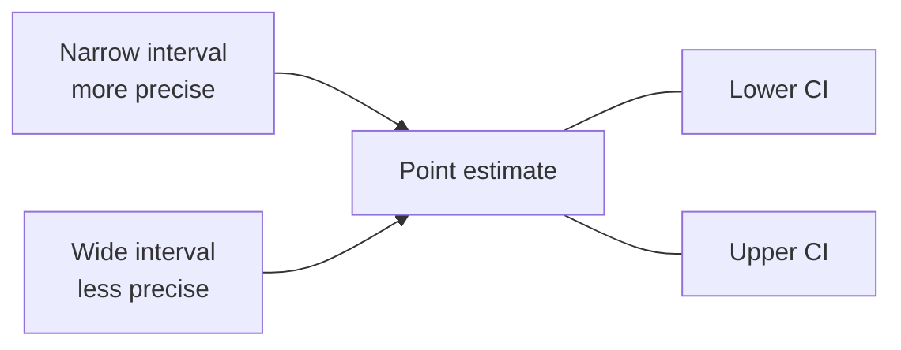

--8<-- "include/glossary.md"

# Statistical Methodology

The CARES RL Statistical Tool progressively aggregates results from individual training runs into task-level statistics and finally benchmark-level conclusions. The statistical pipeline intentionally separates inference into three levels. Individual runs are summarised using AUC measures, robust task-level statistics are then computed from multiple seeds, and benchmark-level conclusions are finally obtained by aggregating evidence across tasks. This prevents raw rewards from being pooled across environments with different reward scales while preserving both within-task and across-task uncertainty.

## Design philosophy

The CARES RL Statistical Tool prioritises robust effect estimation over binary hypothesis testing. The recommended interpretation sequence is:

Estimate the effect.
Quantify uncertainty.
Compare methods directly.
Use significance tests as supplementary evidence.



!!! info "Assumptions"
    The reported statistics assume:

    - independent training seeds;
    - comparable evaluation protocols within each task;
    - fixed benchmark tasks;
    - identical evaluation metrics;
    - comparable training horizons.

## Pipeline

### 1. Seed-level analysis

**Question:** *How did a single training run perform?*

Each seed is summarised using one or more Area Under the Curve (AUC) metrics:

| Input | Output |
|-------|--------|
| Evaluation curve | Full AUC |
| Evaluation curve | Early Window AUC |
| Evaluation curve | Final Window AUC |

!!! info "Choosing an AUC metric"
    The full AUC measures overall performance across the entire training process. The early-window AUC emphasises sample efficiency, while the final-window AUC emphasises late-stage or converged performance. The choice of metric should reflect the research question and practical application.

    Is sample efficiency important? Early Window AUC

    Is final performance important? Final Window AUC
          
    General performance, Full AUC

### 2. Task-level analysis

**Question:** *Which comparison condition performs better on this environment?*

The AUC values from all seeds are aggregated into robust task-level statistics.

| Input | Output |
|-------|--------|
| Seed AUCs | IQM |
| IQM | BCa 95% Confidence Interval |
| Two comparison conditions | Pairwise Probability of Improvement |

### 3. Benchmark-level analysis

**Question:** *Which comparison condition performs better across the entire benchmark?*

The task-level probabilities of improvement are aggregated across every environment to measure overall consistency.

| Input | Output |
|-------|--------|
| Probability of Improvement (per task) | Mean Superiority |
| All benchmark tasks | Cross-Task Probability of Improvement |
| Bootstrap samples | Benchmark Confidence Interval |

### Summary

| Analysis Level | Primary Question | Primary Outputs |
|---|---|---|
| **Seed** | How did one training run behave? | Full, Early & Final AUC |
| **Task** | Which comparison condition performs better on one environment? | IQM + BCa CI, Pairwise Probability of Improvement |
| **Benchmark** | Which comparison condition performs better across the benchmark? | Mean Superiority, Cross-Task Probability of Improvement |

## Methodology Summary

### Within each seed

1. Group evaluation episodes by `total_steps`.
2. Average the selected metric at each step.
3. Calculate trapezoidal full, early-window and final-window AUC.

### Within each task

1. Treat seed AUCs as independent run outcomes.
2. Calculate IQM, mean, standard deviation, range and rank.
3. Calculate a BCa bootstrap interval for IQM by resampling seeds.
4. Calculate pairwise probability of improvement using all cross-condition seed pairs.
5. Calculate Cliff's delta.
6. Retain a paired Wilcoxon test for matched seed IDs or Mann–Whitney U when unmatched seeds are explicitly enabled.
7. Apply Holm correction within each metric family.

### Across fixed benchmark tasks

1. Give every task equal weight.
2. Do not pool or average raw metric magnitudes across tasks.
3. Calculate task superiority from pairwise probabilities against all opponents.
4. Average task superiority to obtain mean superiority.
5. Estimate superiority uncertainty by holding tasks fixed and resampling seeds within each task.
6. Calculate average rank, rank spread and Top-k summaries.
7. Calculate direct cross-task pairwise probabilities and their fixed-task stratified intervals.
8. Retain Friedman and conditional Nemenyi analyses as supplementary rank checks.

!!! important "Fixed-task interpretation"
    Cross-task intervals quantify run-to-run uncertainty for the benchmark that was actually selected. They do not claim that the benchmark tasks are a random sample from every possible environment.

## Statistical Measures

### Full, early and final AUC

The mean evaluation value at each step forms a curve. The tool integrates that curve using the trapezoidal rule.

- **Full AUC** measures performance across the complete training process.
- **Early-window AUC** emphasises early sample efficiency.
- **Final-window AUC** emphasises late-stage or converged performance.

!!! warning "Interpretation"
    AUCs from different training horizons or step grids are not directly comparable. The validation layer prevents these mismatches within a task.

### Interquartile mean

IQM is the mean of the central 50% of observations. It is robust to unusually poor or unusually strong seeds.

!!! warning "Interpretation"
    IQM is a descriptive effect estimate. It does not provide a probability of superiority or a confidence interval.

### BCa bootstrap confidence interval

Per-task IQM intervals use the bias-corrected and accelerated bootstrap with seed as the resampling unit.



A narrow interval indicates greater precision. Overlap with a reference value means the direction remains uncertain at the chosen confidence level.

!!! warning "Interpretation"
    Confidence intervals quantify uncertainty in the estimate. They do not provide a probability that the true value lies within the interval.

### Probability of improvement

For candidate values `C` and baseline values `B`:

```text
P(candidate better) = [wins + 0.5 × ties] / all candidate–baseline pairs
```

!!! warning "Interpretation"
    A probability of 0.5 indicates no clear advantage. A probability of 0.75 indicates that the candidate is expected to outperform the baseline in 75% of random run pairs.

### Mean superiority

Mean Superiority is the average probability of improvement across all benchmark tasks. For each task, an condition's pairwise probabilities against all opponents are averaged. These task-level superiority values are then averaged across tasks.

Mean superiority is scale-free but roster-dependent.

!!! warning "Interpretation"
    Mean superiority is a descriptive effect estimate. It does not provide a probability of superiority or a confidence interval.

### Cliff's delta

Cliff's delta is the signed transformation:

```text
δ = 2 × P(candidate better) - 1
```

- `+1`: every candidate run is better.
- `0`: equal distributional tendency.
- `-1`: every candidate run is worse.

Because it is a direct transformation of probability of improvement, it contains the same ordering information on a different scale.

!!! warning "Interpretation"
    Cliff's delta is a descriptive effect size. It does not provide a probability of superiority or a confidence interval.

### Rank measures

- **Average rank:** mean rank across tasks.
- **Rank SD:** standard deviation of task ranks.
- **Rank IQR:** middle 50% spread of task ranks.
- **Top-k rate:** proportion of tasks on which the comparison condition placed within the top k.

Ranks describe ordering and consistency, not effect magnitude.

!!! warning "Interpretation"
    Ranks are a descriptive consistency measure. They do not provide a probability of superiority or a confidence interval.

### Wilcoxon and Mann–Whitney outputs

The raw task outputs retain:

- paired Wilcoxon signed-rank tests when seed IDs match;
- Mann–Whitney U tests when unmatched seeds are explicitly allowed.

The raw cross-task pairwise output also retains a Wilcoxon test on paired task ranks. These p-values are supplementary and are deliberately excluded from the publication-focused cross-task pairwise table.

!!! warning "Interpretation"
    The primary interpretation should remain effect size plus confidence interval, not whether a p-value crosses 0.05.

### Holm correction

When multiple p-values belong to the same evaluation-metric/performance-summary family, Holm correction controls family-wise error more strongly than interpreting every unadjusted p-value independently.

!!! warning "Interpretation"
    Holm correction is a supplementary consistency check. It does not provide a probability of superiority or a confidence interval.

### Friedman test

The Friedman test asks whether at least one condition's rank distribution differs across tasks. It requires at least three comparison conditions and two tasks.

It does not identify which conditions differ.

!!! warning "Interpretation"
    The Friedman test is a supplementary consistency check. It does not provide a probability of superiority or a confidence interval.

### Nemenyi post-hoc comparison

Nemenyi comparisons are generated only after a significant Friedman test for the same metric group. Two average ranks are marked different when their separation exceeds the critical difference.

!!! warning "Interpretation"
    Friedman and Nemenyi use ranks. They should be presented as supplementary consistency analysis, not as the primary evidence for a reference comparison.


### Publication hierarchy

Not all outputs are equally important for publication. The CARES RL Statistical Tool produces three levels of output:

**Primary:**

- pairwise probability of improvement;
- confidence interval;
- reference-comparison W-T-L record;
- mean superiority for roster-wide summary.

**Supporting:**

- task IQM and BCa interval;
- average rank and rank dispersion;
- Top-k counts.

**Supplementary:**

- Wilcoxon/Mann–Whitney outputs;
- Holm-adjusted p-values;
- Friedman test;
- Nemenyi comparison and critical-difference diagram.


--8<-- "include/links.md"