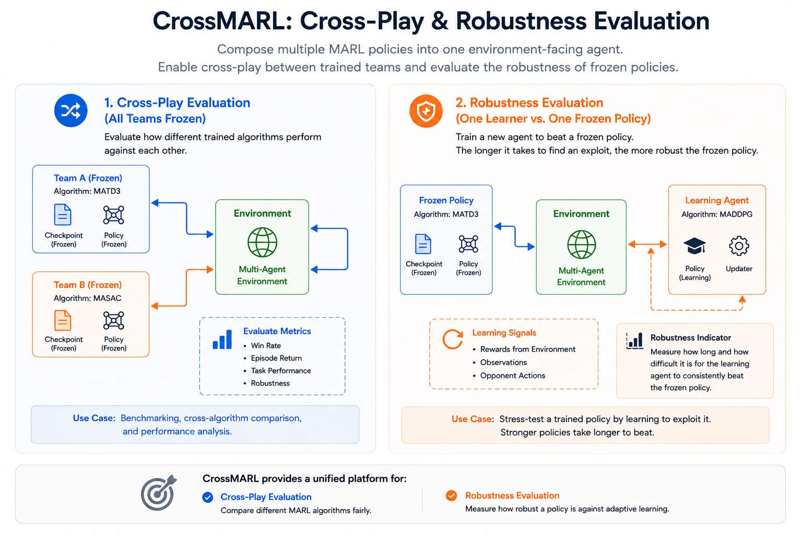

--8<-- "include/glossary.md"

# Multi-Agent Cross Play

`CrossMARL` composes multiple trained MARL policies into a single environment-facing agent.

It is intended for:

- cross-play evaluation between trained MARL algorithms
- robustness testing against frozen opponents
- training one new team against one or more pretrained teams



!!! note
    `CrossMARL` is not a full self-play or league-training system. It supports one learning team at most. All other teams are treated as frozen policies.

## Experiment Composer

Use the `cross_marl_composer.py` helper to create a self-contained `CrossMARL` log folder.

The composer:

1. reads each frozen team's `alg_config.json`
2. validates that all source runs use the same `env_config.json`
3. creates a new `CrossMARL` `alg_config.json`
4. creates a default `train_config.json`
5. copies pretrained models into the new `CrossMARL` folder
6. Optionally creates the learning team's default config in `alg_config.json` if a learning team is specified.

The resulting folder has the usual CARES log structure:

```text
CrossMARL-run/
├── alg_config.json
├── env_config.json
├── train_config.json
└── 10/
    └── models/
        └── final/
            ├── agent/
            └── adversary/
```

## How Loading Works
For each frozen team, the composer copies the original model folder into:

```
CrossMARL-run/<seed>/models/final/<team_name>/
```

During loading, CrossMARL delegates to the original algorithm using that algorithm's name. For example, if `team_a` was trained with `MASAC`, then CrossMARL will call the MASAC loading function for `team_a` and look for the model in:

```text
CrossMARL-run/<seed>/models/final/team_a/
```

!!! tip All-In-One
    This keeps the composed CrossMARL run portable. Once the folder is created, it no longer depends on the original source log folders.

!!! warning "Wrong team passed as frozen"
    If you pass a team as both a frozen team and the learning team, CrossMARL will treat it as a frozen team and ignore any learning configuration. Make sure to only pass pretrained teams as `--team-log` and to only specify the learning team with `--learning-team-name`.

!!! warning "Missing model folder"
    By default, the composer expects pretrained models at:

    ```text
    <source_log>/<seed>/models/final/
    ```

    If your run stores models in a different folder (for example `highest_reward` or a checkpoint folder), specify it using:

    ```bash
    --model-folder highest_reward
    ```

    Example:

    ```bash
    python cross_marl_composer.py \
      --team-log agent=~/logs/MATD3/run \
      --seed 10 \
      --model-folder highest_reward \
      --output-dir ~/logs/CrossMARL/example
    ```

# Cross-play Evaluation

Use this when all teams are pretrained and no team should learn.

```bash
python cross_marl_composer.py \
  --team-log agent=~/cares_rl_logs/MASAC/MASAC-simple_tag_v3-run \
  --team-log adversary=~/cares_rl_logs/MATD3/MATD3-simple_tag_v3-run \
  --seed 10 \
  --output-dir ~/cares_rl_logs/CrossMARL/MASAC_vs_MATD3
```

This creates a `CrossMARL` config with:

```bash
"learning_team_name": null
```

Then evaluate/test using the normal CARES evaluation flow:

```bash
cares-rl test \
  --data_path ~/cares_rl_logs/CrossMARL/MASAC_vs_MATD3 \
  --eval_seed 42 \
  --episodes 10
```

# Robustness Testing
Use this when you want to train one team against one or more frozen teams to test robustness of a trained agent.

```bash
python cross_marl_composer.py \
  --team-log agent=~/cares_rl_logs/MATD3/MATD3-simple_tag_v3-run \
  --learning-team-name adversary \
  --learning-algorithm MADDPG \
  --seed 10 \
  --output-dir ~/cares_rl_logs/CrossMARL/MADDPG_adversary_vs_TD3_agent
```

!!! note Team Configuration
    agent      -> frozen pretrained MATD3 policy

    adversary  -> new MADDPG learner


Then train normally with the new `CrossMARL` config through the usual CARES config training flow:

```bash
cares-rl train config \
  --data_path ~/cares_rl_logs/CrossMARL/MADDPG_adversary_vs_TD3_agent
```

!!! warning "Team Logs vs Learning Team"
    Do not pass the learning team as `--team-log`. `--team-log` is only for frozen pretrained teams.

# Multiple frozen teams
CrossMARL supports more than two teams if the environment provides more team groups. For example, in a 3v3 environment with 6 total agents split into 3 teams of 2 agents each.

```bash
python cross_marl_composer.py \
  --team-log team_a=~/logs/AlgorithmA/run \
  --team-log team_b=~/logs/AlgorithmB/run \
  --team-log team_c=~/logs/AlgorithmC/run \
  --learning-team-name team_d \
  --learning-algorithm MASAC \
  --seed 10 \
  --output-dir ~/cares_rl_logs/CrossMARL/team_d_vs_population
```

--8<-- "include/links.md"

