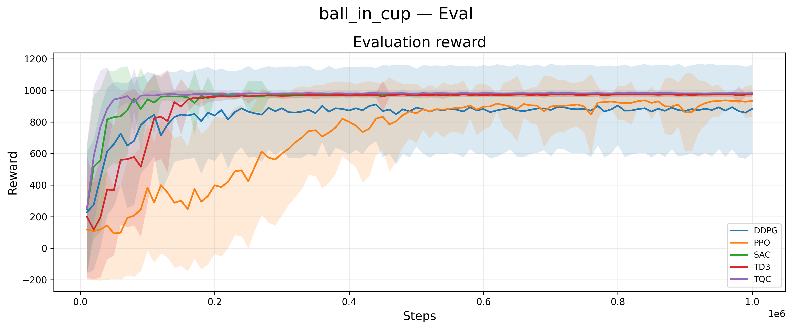
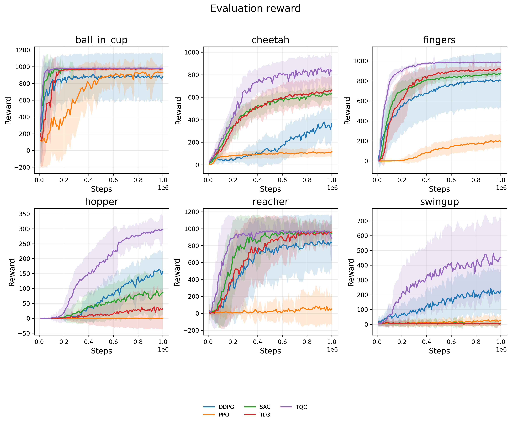
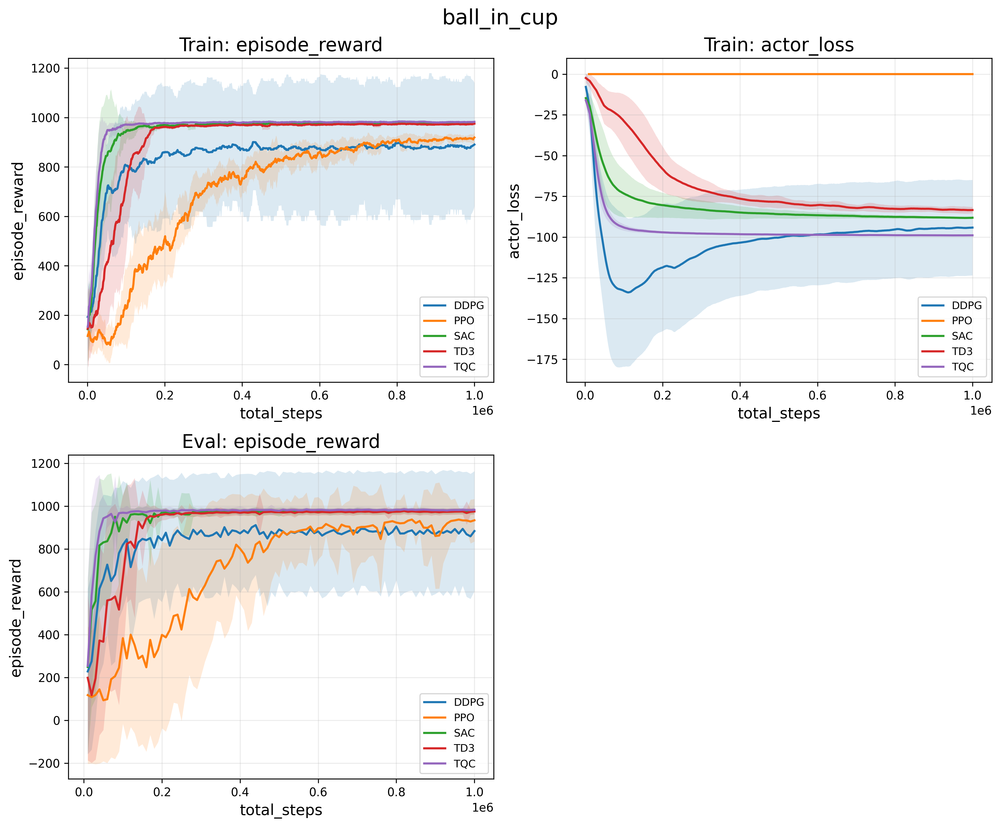
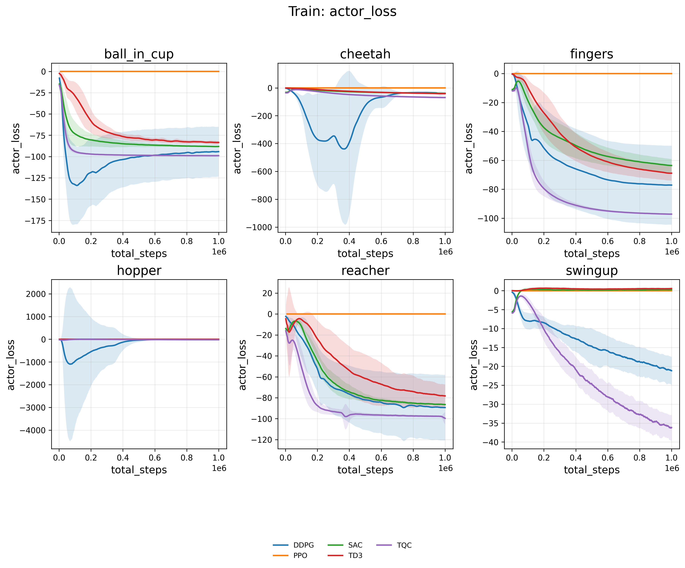
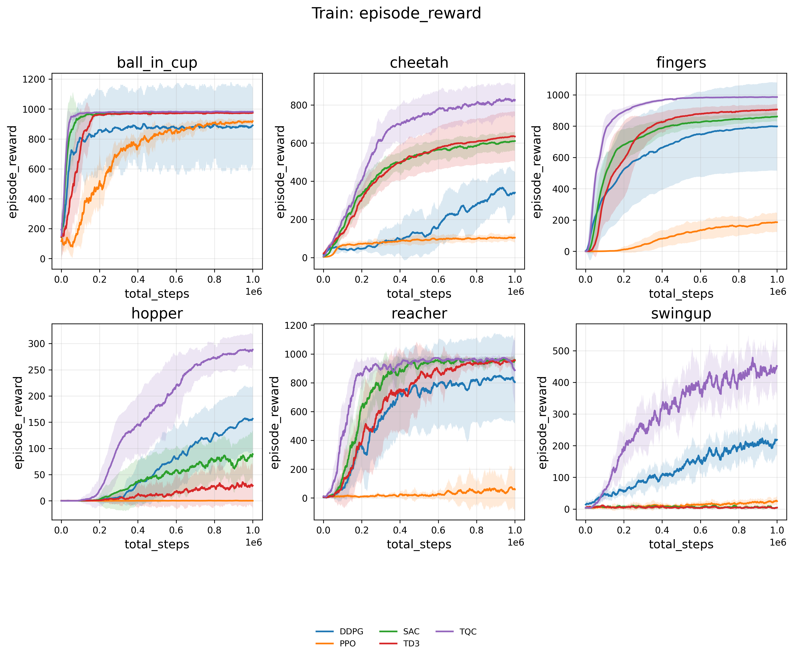
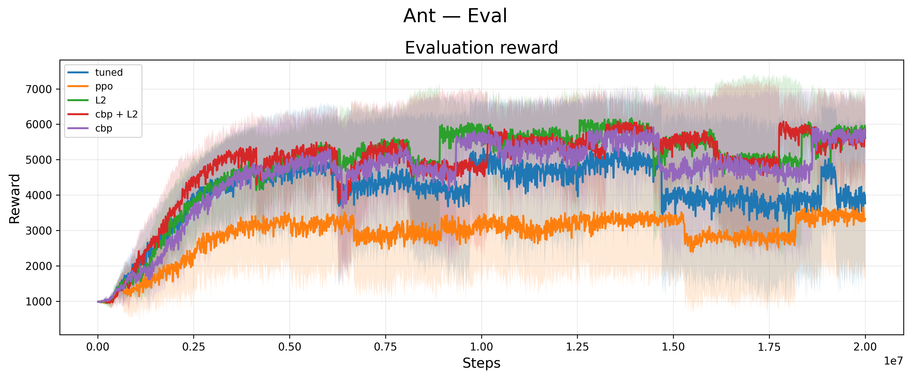
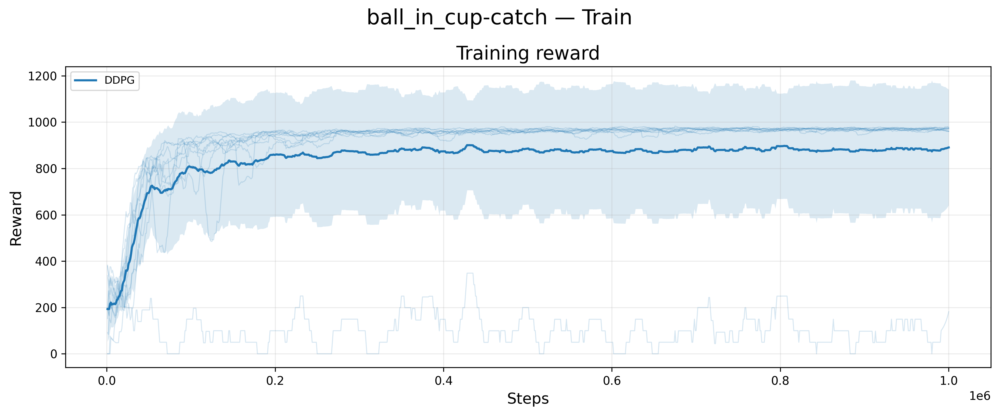

--8<-- "include/glossary.md"

# Plotting Guide

This guide covers the CARES RL plotting CLI utility, which can plot data from one task, multiple tasks, or explicit run directories. It supports multi-panel figures, dual y-axes, and a wide range of customization options.

## Command Overview

```text
cares-rl-plot (--tasks TASKS | --task TASK | --data RUN [RUN ...]) [options]
```

Input modes:

- `--tasks`: root directory containing multiple task directories.
- `--task`: one task directory containing comparison/run folders.
- `--data`: explicit run directories to compare as one task.

Output:

- `--output` is required for figure generation.

### Task Plotting

Plot multiple algorithms across one task:

```bash
cares-rl-plot \
    --task <TASK_DIRECTORY> \
    --output ~/cares_rl_plots
```

Example:

```bash
cares-rl-plot \
    --task ~/cares_rl_logs/Tasks/ball_in_cup \
    --output ~/cares_rl_plots
```



### Tasks Plotting
Plot all tasks under a benchmark root as a combined task-grid view:

```bash
cares-rl-plot \
    --tasks ~/cares_rl_logs/tasks_root \
    --output ~/cares_rl_plots
```

Example:

```bash
cares-rl-plot \
    --tasks ~/hpc_outputs/Tasks \
    --output ~/cares_rl_logs/figures
```



!!! note "Separate Tasks"
    Use `--separate` to render one figure per discovered task instead of a combined task-grid for `--tasks`. This is useful for large benchmarks with many tasks or when tasks have different reward scales.

    ```bash
    cares-rl-plot \
        --tasks ~/cares_rl_logs/tasks_root \
        --separate \
        --output ~/cares_rl_plots
    ```

### Data Plotting

Plot multiple explicit run directories as one comparison task:

```bash
cares-rl-plot \
    --data \
    ~/cares_rl_logs/SAC/SAC-HalfCheetah-v4-YY_MM_DD:HH:MM:SS \
    ~/cares_rl_logs/TD3/TD3-HalfCheetah-v4-YY_MM_DD:HH:MM:SS \
    --output ~/cares_rl_plots
```

## Plot Customization
Plotting options are available to customize figure layout, style, and content.

### Custom Plot Panels

Use repeated `--plot` values to define custom panels within a figure. This enables you to plot multiple metrics on the same axes, or to create multi-panel figures with different metrics.

Supported keys:

- `source`: `train` or `eval` (required).
- `y`: comma-separated primary-axis columns (required).
- `x`: x-axis column (default `total_steps`).
- `y2`: comma-separated secondary-axis columns.
- `title`, `x_label`, `y_label`, `y2_label`.
- `x_scale`, `y_scale`, `y2_scale` (`linear` or `log`).

Format:

```text
"source=train;x=<VALUE>;y=<Y1_A>,...,<Y1_Z>;y2=<Y2_A>,...,<Y2_Z>;title=<TITLE>"
```

Example `--task`:

```bash
cares-rl-plot \
    --task ~/hpc_outputs/Tasks/ball_in_cup/ \
    --output ~/cares_rl_logs/figures \
    --plot "source=train;x=total_steps;y=episode_reward" \
    --plot "source=train;x=total_steps;y=actor_loss" \
    --plot "source=eval;x=total_steps;y=episode_reward"
```



Example `--tasks`:

```bash
cares-rl-plot \
    --tasks ~/hpc_outputs/Tasks/ \
    --output ~/cares_rl_logs/figures \
    --plot "source=train;x=total_steps;y=episode_reward" \
    --plot "source=train;x=total_steps;y=actor_loss" 
```





!!! note "Tasks and --plot"
    Using `--tasks` with `--plot` generates one figure per `--plot`, with one subplot for each discovered task.

    Using `--tasks --separate` generates one figure per task, with each supplied `--plot` shown as a subplot within that task's figure. Effectively equivalent to running `--task <TASK> --plot ...` for each discovered task.


### Comparison Parameters
When multiple runs share the same algorithm name (e.g. from an ablation study) use `--comparison-parameter` to specify one or more distinguishing configuration paths. 

```bash
cares-rl-plot \
    --task <BENCHMARK_ROOT> \
    --comparison-parameter alg_config.<PARAMETER_A> \
    --comparison-parameter alg_config.<PARAMETER_B> \
    --output ~/cares_rl_plots
```

!!! note "Multiple Comparison Parameters"
    Use `--comparison-parameter` repeatedly to specify multiple distinguishing configuration paths. The order of the parameters determines the order of the values in the generated comparison label.

The comparison legend label for each run is generated as:

```
<algorithm> [<comparison-parameter>=<value>, ...]
```

!!! note "Legend Labels"
    Use `--legend-label` to override the legend label for each discovered comparison in the order they are discovered to make them tidier for publications.

Example:

```bash
cares-rl-plot \
    --task ~/hpc_outputs/Ant/ \
    --output ~/cares_rl_logs/figures/ \
    --comparison-parameter alg_config.plasticity_config.replacement_enabled \
    --comparison-parameter alg_config.actor_lr_params.weight_decay \
    --comparison-parameter alg_config.actor_lr_params.betas \
    --legend-label "tuned" \
    --legend-label "ppo" \
    --legend-label "L2" \
    --legend-label "cbp + L2" \
    --legend-label "cbp"
```



### Legend Labels
Use `--legend-label` to override the legend label for each discovered comparison in the order they are discovered.

```bash
cares-rl-plot \
    --task <TASK_DIRECTORY> \
    --legend-label "Method A" \
    --legend-label "Method B" \
    --output ~/cares_rl_plots
```

!!! note "Plotting Order"
    List discovered comparisons without rendering to see what will be plotted in what order:

    ```bash
    cares-rl-plot \
        --task <TASK_DIRECTORY> \
        --list-comparisons
    ```

### Layout and Style Controls

Common formatting options:

- `--title`
- `--rows`, `--columns`
- `--width`, `--panel-height`
- `--dpi`
- `--format` (repeatable, default `png`)
- `--label-fontsize`, `--title-fontsize`, `--ticks-fontsize`, `--legend-fontsize`

Example:

```bash
cares-rl-plot \
    --task <TASK_DIRECTORY> \
    --title "HalfCheetah Comparison" \
    --columns 2 \
    --width 14 \
    --panel-height 4.5 \
    --format png \
    --format pdf \
    --dpi 300 \
    --output ~/cares_rl_plots
```

## Train-Series Processing

For train-series smoothing and alignment:

- `--train-window-size`: centered rolling mean window (default `20`).
- `--train-bin-size`: optional fixed step bin width before aggregation (default `1`).

Display controls:

- `--plot-seeds`
- `--no-mean`
- `--no-std`

Example:

```bash
cares-rl-plot \
    --task <TASK_DIRECTORY> \
    --plot-seeds \
    --output ~/cares_rl_plots
```



## Troubleshooting

- If no runs are discovered, verify each run directory contains numeric seed folders with `data/train.csv` and/or `data/eval.csv`.
- If legend labels fail, ensure the number of `--legend-label` values exactly matches discovered comparisons.
- If multiple runs share one algorithm name, add `--comparison-parameter` so comparison labels become unique.

For complete option help, run:

```bash
cares-rl-plot -h
```

--8<-- "include/links.md"
